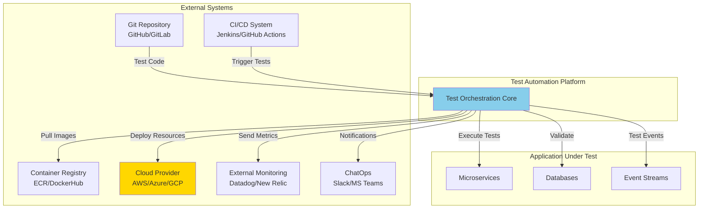
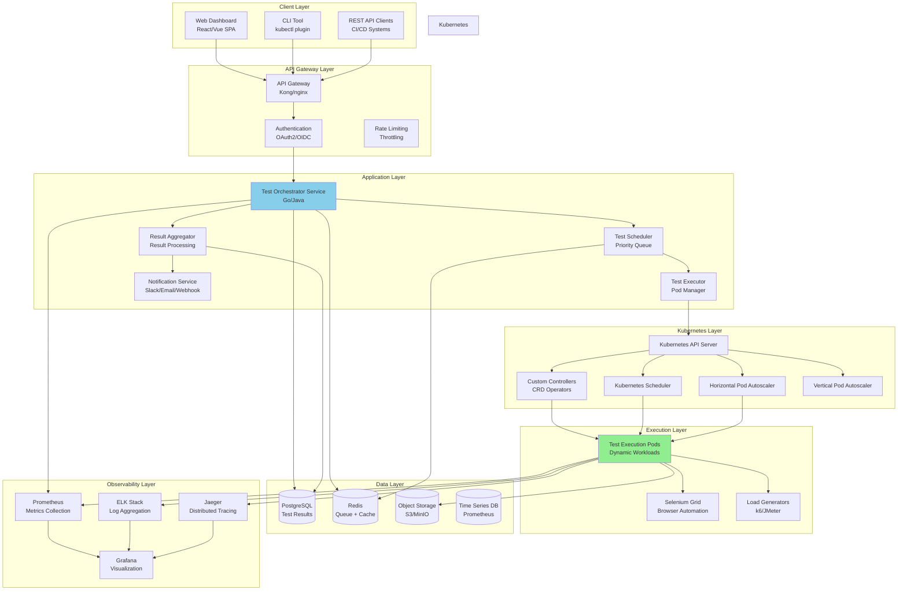
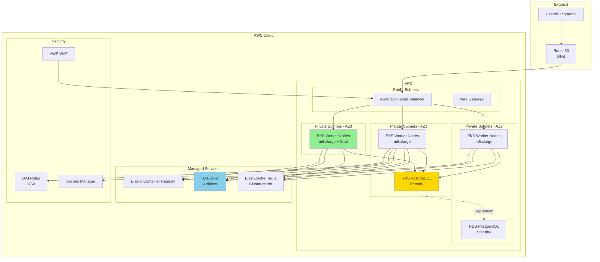
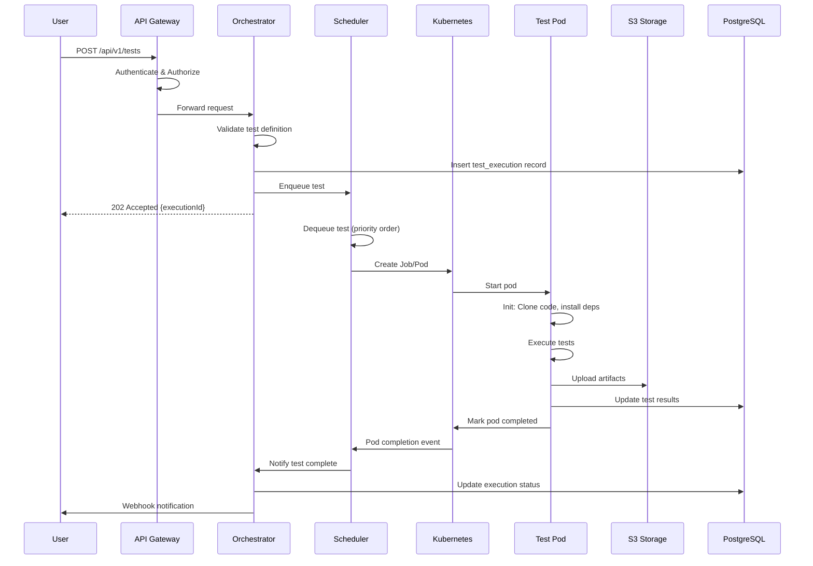
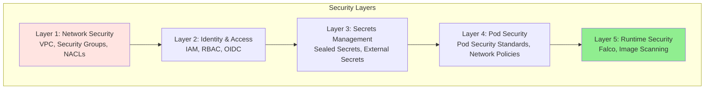
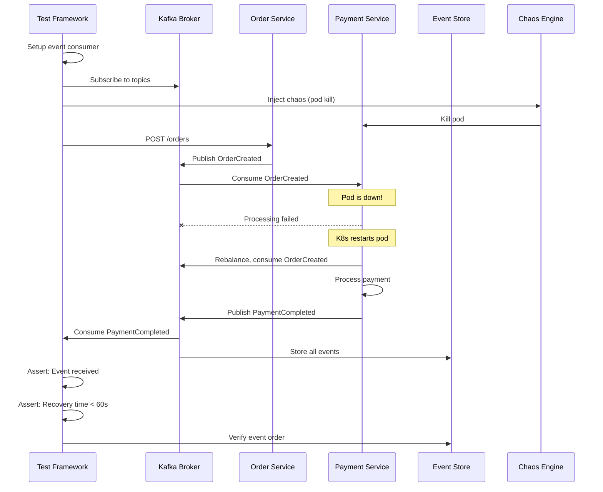
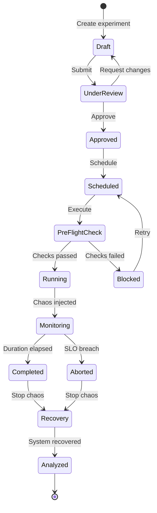
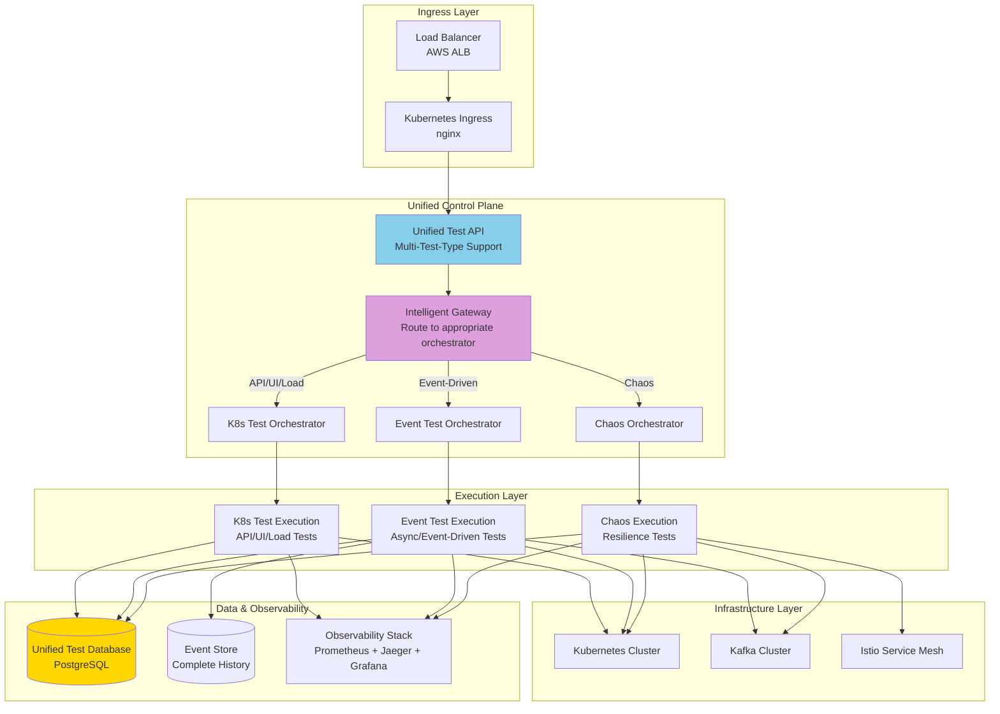

# High-Level Design (HLD)
## Enterprise Test Automation Architectures

---

## Table of Contents
1. [System Overview](#overview)
2. [Architecture #1: Kubernetes-Native Test Orchestration HLD](#k8s-hld)
3. [Architecture #2: Event-Driven + Chaos Engineering HLD](#event-chaos-hld)
4. [Hybrid Architecture HLD](#hybrid-hld)
5. [Cross-Cutting Concerns](#cross-cutting)

---

## 1. System Overview {#overview}

### 1.1 Purpose
Design and implement a scalable, cloud-native test automation platform capable of:
- Running 1000+ parallel test executions
- Supporting multiple test types (API, UI, Load, Event-driven, Chaos)
- Providing sub-15-minute feedback for full regression suites
- Validating system resilience through controlled chaos experiments
- Operating across multiple environments (dev, staging, production)

### 1.2 Stakeholders

| Stakeholder | Role | Interest |
|------------|------|----------|
| QA Engineers | Primary Users | Execute tests, analyze results |
| Developers | Contributors | Write tests, fix failures |
| DevOps/SRE | Infrastructure | Maintain platform, ensure reliability |
| Product Managers | Business | Quality metrics, release confidence |
| Security Team | Compliance | Security testing, vulnerability scanning |
| Finance | Cost Control | Infrastructure cost optimization |

### 1.3 System Context Diagram



### 1.4 Key Requirements

#### Functional Requirements
- **FR1**: Support multiple test framework types (Selenium, Cypress, k6, Postman, Playwright)
- **FR2**: Execute tests in parallel with configurable concurrency
- **FR3**: Provide real-time test execution monitoring
- **FR4**: Store and retrieve test artifacts (screenshots, videos, logs)
- **FR5**: Support event-driven test patterns for async workflows
- **FR6**: Enable chaos engineering experiments with safety controls
- **FR7**: Integrate with CI/CD pipelines via APIs and webhooks
- **FR8**: Generate comprehensive test reports with analytics

#### Non-Functional Requirements
- **NFR1**: **Scalability** - Support 1000+ concurrent test executions
- **NFR2**: **Performance** - Complete full regression in < 15 minutes
- **NFR3**: **Reliability** - 99.9% platform uptime
- **NFR4**: **Cost Efficiency** - Optimize infrastructure costs through autoscaling and spot instances
- **NFR5**: **Security** - RBAC, secrets management, network isolation
- **NFR6**: **Observability** - Comprehensive metrics, logs, and traces
- **NFR7**: **Maintainability** - Infrastructure as Code, GitOps
- **NFR8**: **Extensibility** - Plugin architecture for new test types

---

## 2. Architecture #1: Kubernetes-Native Test Orchestration HLD {#k8s-hld}

### 2.1 System Architecture Overview



### 2.2 Component Descriptions

#### 2.2.1 Client Layer Components

**Web Dashboard**
- Technology: React with TypeScript, Material-UI
- Purpose: Interactive UI for test management
- Features:
  - Test execution triggering
  - Real-time test monitoring
  - Result visualization
  - Analytics dashboards
  - User management

**CLI Tool**
- Technology: Go binary, kubectl plugin
- Purpose: Command-line interface for power users
- Features:
  - Test submission from terminal
  - Log streaming
  - Result queries
  - Scripting support

#### 2.2.2 API Gateway Layer

**API Gateway (Kong/nginx)**
- Purpose: Single entry point for all API requests
- Responsibilities:
  - Request routing
  - SSL termination
  - Request/response transformation
  - API versioning
- Technology: Kong Gateway with PostgreSQL backend

**Authentication Service**
- Purpose: Secure API access
- Technology: OAuth2/OIDC (Keycloak/Auth0)
- Features:
  - JWT token validation
  - Role-Based Access Control (RBAC)
  - Service-to-service authentication
  - API key management

#### 2.2.3 Application Layer

**Test Orchestrator Service**
- Technology: Go (high performance, concurrency)
- Purpose: Core business logic coordinator
- Responsibilities:
  - Test definition validation
  - Resource quota management
  - Test lifecycle management
  - Integration with Kubernetes API
- APIs:
  - `POST /api/v1/tests` - Submit test
  - `GET /api/v1/tests/{id}` - Get test status
  - `DELETE /api/v1/tests/{id}` - Cancel test
  - `GET /api/v1/tests` - List tests

**Test Scheduler**
- Technology: Go with priority queue (heap)
- Purpose: Intelligent test scheduling
- Algorithm:
  - Priority-based scheduling (P0 > P1 > P2)
  - Fair queuing within same priority
  - Resource-aware scheduling
  - Anti-affinity for distributed execution
- Queue: Redis-backed persistent queue

**Test Executor**
- Technology: Go Kubernetes client
- Purpose: Pod/Job lifecycle management
- Responsibilities:
  - Create Kubernetes Jobs/Pods
  - Monitor execution status
  - Handle retries and failures
  - Resource allocation
  - Pod cleanup (TTL)

**Result Aggregator**
- Technology: Java Spring Boot
- Purpose: Collect and process test results
- Responsibilities:
  - Parse test framework outputs (JUnit XML, JSON)
  - Aggregate results across parallel executions
  - Calculate test metrics
  - Store results in PostgreSQL
  - Trigger notifications

#### 2.2.4 Data Layer

**PostgreSQL Database**
- Purpose: Persistent storage for test metadata and results
- Schema:
  - `test_definitions` - Test configurations
  - `test_executions` - Execution history
  - `test_results` - Individual test results
  - `test_artifacts` - Artifact metadata
  - `users` - User management
- Backup: Daily backups to S3, point-in-time recovery

**Redis**
- Purpose: High-performance queue and cache
- Use Cases:
  - Test execution queue
  - Session management
  - Rate limiting counters
  - Real-time test status cache
- Configuration: Redis Cluster (3 masters, 3 replicas)

**Object Storage (S3/MinIO)**
- Purpose: Artifact storage
- Stored Data:
  - Test screenshots (PNG/JPEG)
  - Test videos (MP4/WebM)
  - Test logs (JSON/TXT)
  - HTML reports
  - JUnit XML files
- Lifecycle Policy: Expire artifacts after 90 days

### 2.3 Technology Stack Summary

| Layer | Technology | Justification |
|-------|-----------|---------------|
| **Orchestration** | Go | High performance, excellent K8s client library |
| **API Gateway** | Kong | Feature-rich, plugin ecosystem |
| **Authentication** | Keycloak | Open-source, OIDC/OAuth2 support |
| **Queue** | Redis | High throughput, persistence, pub/sub |
| **Database** | PostgreSQL | ACID compliance, JSON support, mature |
| **Object Storage** | S3/MinIO | Scalable, cost-effective, S3-compatible |
| **Container Orchestration** | Kubernetes | Industry standard, scalability, ecosystem |
| **Metrics** | Prometheus | Pull-based, PromQL, ecosystem |
| **Logging** | ELK Stack | Full-text search, visualization |
| **Tracing** | Jaeger | OpenTelemetry compatible, distributed tracing |
| **Dashboards** | Grafana | Multi-datasource, alerting, dashboards |

### 2.4 Deployment Architecture



### 2.5 Data Flow - Test Execution



### 2.6 Scalability Strategy

| Concern | Strategy | Implementation |
|---------|----------|----------------|
| **API Layer** | Horizontal scaling | Multiple API Gateway pods with load balancing |
| **Test Execution** | Massive parallelization | 1000+ test pods across cluster |
| **Database** | Read replicas | PostgreSQL read replicas for queries |
| **Queue** | Sharding | Redis cluster with hash-based sharding |
| **Storage** | Cloud-native | S3 auto-scales, unlimited capacity |
| **Cluster** | Autoscaling | Cluster Autoscaler + HPA/VPA |

### 2.7 Security Architecture



**Security Controls:**
1. **Network Isolation**: Private subnets, no public IPs on pods
2. **Authentication**: OAuth2/OIDC via Keycloak
3. **Authorization**: Kubernetes RBAC + custom policies
4. **Secrets**: AWS Secrets Manager + External Secrets Operator
5. **Encryption**: TLS for all traffic, encryption at rest for data
6. **Image Security**: Image scanning (Trivy), signed images
7. **Runtime Security**: Pod Security Standards (restricted), Falco monitoring
8. **Audit**: Kubernetes audit logs to CloudWatch

---

## 3. Architecture #2: Event-Driven + Chaos Engineering HLD {#event-chaos-hld}

### 3.1 System Architecture Overview

```mermaid
graph TB
    subgraph Test Framework Layer
        TestDSL[Test DSL Engine<br/>Define Event Tests]
        TestRunner[Test Runner<br/>Execute Event Tests]
        AssertEngine[Assertion Engine<br/>Event Validation]
    end

    subgraph Chaos Control Plane
        ChaosAPI[Chaos API<br/>Experiment Management]
        ChaosScheduler[Chaos Scheduler<br/>Experiment Execution]
        AIEngine[AI Chaos Engine<br/>Target Selection]
        SafetyGate[Safety Gate<br/>Pre-flight Checks]
    end

    subgraph Event Streaming Platform
        Kafka[Apache Kafka<br/>Event Backbone]
        SchemaReg[Schema Registry<br/>Avro/Protobuf]
        Connect[Kafka Connect<br/>CDC Pipelines]
        Streams[Kafka Streams<br/>Stream Processing]
    end

    subgraph Chaos Execution Layer
        Litmus[LitmusChaos<br/>K8s-native Chaos]
        Gremlin[Gremlin<br/>Enterprise Chaos]
        Toxiproxy[Toxiproxy<br/>Network Chaos]
        AWSFIS[AWS FIS<br/>Cloud Chaos]
    end

    subgraph Microservices Under Test
        OrderSvc[Order Service]
        PaymentSvc[Payment Service]
        InventorySvc[Inventory Service]
        FulfillmentSvc[Fulfillment Service]
    end

    subgraph Service Mesh
        IstioCP[Istio Control Plane]
        Envoy[Envoy Sidecars]
        FaultInject[Istio Fault Injection]
    end

    subgraph Event Store
        EventStoreDB[(EventStoreDB<br/>Append-only Log)]
        Projections[Event Projections<br/>Read Models]
        Snapshots[Snapshots<br/>Aggregate State)]
    end

    subgraph Observability
        Prometheus[Prometheus<br/>Metrics]
        Jaeger[Jaeger<br/>Distributed Tracing]
        Grafana[Grafana<br/>Dashboards]
    end

    TestDSL --> TestRunner
    TestRunner --> AssertEngine
    TestRunner --> ChaosAPI

    ChaosAPI --> SafetyGate
    SafetyGate --> ChaosScheduler
    ChaosScheduler --> AIEngine

    ChaosScheduler --> Litmus
    ChaosScheduler --> Gremlin
    ChaosScheduler --> Toxiproxy
    ChaosScheduler --> AWSFIS

    TestRunner --> Kafka
    OrderSvc --> Kafka
    PaymentSvc --> Kafka
    InventorySvc --> Kafka
    FulfillmentSvc --> Kafka

    Kafka --> SchemaReg
    Kafka --> Connect
    Kafka --> Streams

    Kafka --> EventStoreDB
    EventStoreDB --> Projections
    EventStoreDB --> Snapshots

    Litmus --> OrderSvc
    Gremlin --> PaymentSvc
    Toxiproxy --> Kafka

    OrderSvc --> Envoy
    PaymentSvc --> Envoy
    InventorySvc --> Envoy
    FulfillmentSvc --> Envoy

    Envoy --> IstioCP
    IstioCP --> FaultInject

    TestRunner --> Prometheus
    OrderSvc --> Prometheus
    ChaosScheduler --> Prometheus

    TestRunner --> Jaeger
    OrderSvc --> Jaeger
    Envoy --> Jaeger

    Prometheus --> Grafana
    Jaeger --> Grafana

    style Kafka fill:#FFD700
    style ChaosScheduler fill:#FFB6C1
    style AIEngine fill:#DDA0DD
    style EventStoreDB fill:#90EE90
```

### 3.2 Component Descriptions

#### 3.2.1 Event Streaming Components

**Apache Kafka Cluster**
- Purpose: High-throughput event streaming backbone
- Configuration:
  - 3 brokers (minimum for production)
  - Replication factor: 3
  - Min in-sync replicas: 2
  - Retention: 7 days default, infinite for event sourcing
- Topics:
  - `order.created`, `order.updated`, `order.cancelled`
  - `payment.initiated`, `payment.completed`, `payment.failed`
  - `inventory.reserved`, `inventory.released`
  - `test.events` - Test framework events

**Schema Registry**
- Purpose: Schema management and evolution
- Technology: Confluent Schema Registry
- Features:
  - Schema versioning
  - Compatibility checking (backward, forward, full)
  - Avro/Protobuf/JSON schema support
- Integration: Producers/consumers use schemas for serialization

**Kafka Connect**
- Purpose: Change Data Capture (CDC) and integrations
- Connectors:
  - Debezium for PostgreSQL CDC
  - S3 Sink for event archival
  - Elasticsearch Sink for event search
- Configuration: Distributed mode (3 workers)

#### 3.2.2 Chaos Engineering Components

**Chaos API Service**
- Technology: Python FastAPI
- Purpose: Chaos experiment management
- APIs:
  - `POST /api/v1/experiments` - Create experiment
  - `POST /api/v1/experiments/{id}/start` - Start experiment
  - `POST /api/v1/experiments/{id}/abort` - Abort experiment
  - `GET /api/v1/experiments/{id}/results` - Get results
- Features:
  - Experiment templates library
  - Scheduling (cron, one-time, event-triggered)
  - Approval workflows

**AI Chaos Engine**
- Technology: Python with scikit-learn, networkx
- Purpose: Intelligent chaos target selection
- Algorithms:
  - Dependency graph analysis (networkx)
  - Traffic pattern analysis (time-series ML)
  - Impact prediction (random forest classifier)
  - Reinforcement learning for experiment selection
- Inputs:
  - Service dependency graph (from Istio)
  - Traffic metrics (from Prometheus)
  - Historical failure data
- Outputs:
  - Ranked list of chaos targets
  - Predicted blast radius
  - Recommended experiment parameters

**Safety Gate Service**
- Technology: Go
- Purpose: Pre-flight safety checks
- Checks:
  - No active incidents (PagerDuty API)
  - On-call engineer available (PagerDuty API)
  - No recent deployments (check last 2 hours)
  - System health metrics within SLO
  - Required approvals obtained
- Decision: Proceed, postpone, or abort experiment

**Chaos Providers Integration**

*LitmusChaos*
- Type: Kubernetes-native chaos
- Experiments:
  - Pod delete, pod kill
  - Container kill
  - Node drain, node CPU hog, node memory hog
  - Network latency, packet loss, partition
- Implementation: Kubernetes CRDs (ChaosEngine, ChaosExperiment)

*Gremlin (SaaS)*
- Type: Enterprise chaos platform
- Experiments:
  - Resource: CPU, memory, disk, I/O
  - State: Process killer, shutdown
  - Network: Latency, packet loss, DNS, blackhole
- Integration: Gremlin API via SDK

*Toxiproxy*
- Type: Network proxy for simulating failures
- Use Case: Message broker failures
- Toxics:
  - Latency (add delay)
  - Down (connection closed)
  - Bandwidth (limit throughput)
  - Slow_close (gradual connection closure)
  - Timeout (connection timeout)

#### 3.2.3 Event Store & CQRS

**EventStoreDB**
- Purpose: Event sourcing and CQRS implementation
- Features:
  - Append-only event log
  - Projections for read models
  - Subscriptions for real-time updates
  - Point-in-time queries
- Configuration:
  - Cluster: 3 nodes
  - Persistent subscriptions for consumers
  - Snapshots every 1000 events

**Event Projections**
- Purpose: Build read models from events
- Technology: EventStoreDB projections (JavaScript) or custom (Java/Go)
- Examples:
  - `order-summary` - Current order state
  - `user-orders` - All orders by user
  - `daily-sales` - Daily sales aggregation

### 3.3 Event-Driven Test Pattern



### 3.4 Technology Stack Summary

| Component | Technology | Justification |
|-----------|-----------|---------------|
| **Event Streaming** | Apache Kafka | Industry standard, high throughput, durability |
| **Schema Management** | Confluent Schema Registry | Schema evolution, compatibility |
| **Event Store** | EventStoreDB | Purpose-built for event sourcing |
| **Chaos Orchestration** | Custom (Python/Go) | Flexibility, multi-provider support |
| **Chaos Execution** | LitmusChaos + Gremlin | K8s-native + enterprise features |
| **Service Mesh** | Istio | Traffic management, fault injection, observability |
| **AI/ML** | Python (scikit-learn) | Mature ML ecosystem |
| **Test Framework** | Custom (Java/Go) | Event-driven test patterns |

### 3.5 Chaos Experiment Lifecycle



---

## 4. Hybrid Architecture HLD {#hybrid-hld}

### 4.1 Unified System Architecture



### 4.2 Integration Points

| Source System | Target System | Integration Method | Purpose |
|--------------|---------------|-------------------|---------|
| K8s Orchestrator | Event Orchestrator | Shared Kafka topics | Trigger event tests after K8s tests |
| K8s Orchestrator | Chaos Orchestrator | REST API calls | Trigger chaos during K8s tests |
| Event Orchestrator | Chaos Orchestrator | Event-driven triggers | Chaos based on event patterns |
| All Orchestrators | Unified Database | JDBC/pg client | Store all test results |
| All Orchestrators | Observability Stack | Prometheus SDK | Unified metrics |
| Chaos Orchestrator | Event Store | Event consumer | Validate event consistency during chaos |

### 4.3 Deployment Strategy

**Multi-Cluster Deployment:**
- **Test Cluster**: Dedicated for test execution workloads
- **Platform Cluster**: Test orchestration services
- **Application Cluster**: Application under test

**Benefits:**
- Isolation of test workloads from platform services
- Independent scaling
- Blast radius control for chaos experiments
- Cost optimization (spot instances for test cluster)

---

## 5. Cross-Cutting Concerns {#cross-cutting}

### 5.1 Monitoring & Observability

**Metrics (Prometheus)**
```
# Test Execution Metrics
test_execution_duration_seconds{test_type, status}
test_execution_total{test_type, status}
test_queue_depth{priority}
test_pod_resource_usage{resource, pod}

# Chaos Metrics
chaos_experiment_duration_seconds{experiment_type, result}
chaos_slo_breach_total{service, experiment}
chaos_recovery_time_seconds{service}

# Event Metrics
event_processing_duration_seconds{event_type, consumer}
event_consumer_lag{topic, partition, consumer_group}
event_schema_errors_total{topic}
```

**Logging Strategy**
- Structured JSON logging (ECS format)
- Correlation IDs for distributed tracing
- Log levels: DEBUG, INFO, WARN, ERROR, FATAL
- Retention: 30 days in Elasticsearch, 90 days in S3

**Distributed Tracing**
- OpenTelemetry instrumentation
- Trace context propagation via HTTP headers
- Jaeger backend for trace storage and visualization
- Key spans: test execution, event processing, chaos injection

### 5.2 Disaster Recovery

**Backup Strategy:**
- PostgreSQL: Daily full backups, 5-minute PITR
- Redis: AOF + RDB snapshots every 5 minutes
- Event Store: Continuous replication to S3
- Kubernetes: etcd snapshots every 6 hours

**Recovery Objectives:**
- RTO (Recovery Time Objective): 1 hour
- RPO (Recovery Point Objective): 5 minutes

**DR Procedures:**
1. Restore PostgreSQL from latest backup
2. Restore Redis from latest snapshot
3. Restore Kubernetes cluster from etcd snapshot
4. Redeploy applications via GitOps (ArgoCD)
5. Validate system health

### 5.3 Cost Optimization

**Strategies:**
1. **Spot Instances**: 70% of test execution nodes
2. **Cluster Autoscaling**: Scale to zero during off-hours
3. **Resource Right-Sizing**: VPA recommendations
4. **S3 Lifecycle Policies**: Move to Glacier after 30 days
5. **Reserved Instances**: Core platform services
6. **Multi-Tenancy**: Shared clusters with namespace isolation

**Cost Monitoring:**
- Kubecost for Kubernetes cost allocation
- AWS Cost Explorer for cloud costs
- Custom dashboards for cost per test execution
- Budget alerts at 80% threshold

### 5.4 Compliance & Security

**Compliance Requirements:**
- SOC 2 Type II
- GDPR (for EU data)
- HIPAA (if testing healthcare apps)

**Security Controls:**
- Encryption at rest (AES-256)
- Encryption in transit (TLS 1.3)
- Secrets rotation (30 days)
- Vulnerability scanning (Trivy, Snyk)
- Network policies (deny-all default)
- Pod Security Standards (restricted)
- Regular security audits (quarterly)

---

## Summary

This HLD document provides:
- ✅ Complete system architecture for both architectures
- ✅ Component descriptions with technology choices
- ✅ Deployment strategies and infrastructure design
- ✅ Data flow and integration patterns
- ✅ Scalability, security, and reliability strategies
- ✅ Hybrid architecture combining both approaches
- ✅ Cross-cutting concerns (monitoring, DR, cost, compliance)

**Next Steps**: Proceed to Low-Level Design (LLD) for detailed component design, APIs, data models, and algorithms.
