# Implementation & Comparison Diagrams
## Practical Guides for Test Automation Architecture Adoption

---

## Table of Contents
1. [Architecture Comparison Diagrams](#comparison)
2. [Cost Analysis Diagrams](#cost)
3. [Implementation Roadmap Diagrams](#roadmap)
4. [Team Structure Diagrams](#team)
5. [Decision Trees](#decisions)

---

## 1. Architecture Comparison Diagrams {#comparison}

### 1.1 Feature Comparison Matrix

```mermaid
graph TB
    subgraph K8s-Native Features
        K1[Dynamic Scaling<br/>★★★★★]
        K2[Cost Optimization<br/>★★★★☆]
        K3[Parallel Execution<br/>★★★★★]
        K4[Resource Control<br/>★★★★★]
        K5[Traditional Testing<br/>★★★★★]
        K6[Event Testing<br/>★★☆☆☆]
        K7[Resilience Testing<br/>★★★☆☆]
        K8[Learning Curve<br/>★★★☆☆]
    end

    subgraph Event+Chaos Features
        E1[Dynamic Scaling<br/>★★★☆☆]
        E2[Cost Optimization<br/>★★★★★]
        E3[Parallel Execution<br/>★★★☆☆]
        E4[Resource Control<br/>★★★☆☆]
        E5[Traditional Testing<br/>★★☆☆☆]
        E6[Event Testing<br/>★★★★★]
        E7[Resilience Testing<br/>★★★★★]
        E8[Learning Curve<br/>★★☆☆☆]
    end

    subgraph Hybrid Approach
        H1[Dynamic Scaling<br/>★★★★★]
        H2[Cost Optimization<br/>★★★★☆]
        H3[Parallel Execution<br/>★★★★★]
        H4[Resource Control<br/>★★★★★]
        H5[Traditional Testing<br/>★★★★★]
        H6[Event Testing<br/>★★★★★]
        H7[Resilience Testing<br/>★★★★★]
        H8[Learning Curve<br/>★★☆☆☆]
    end

    style K8s-Native Features fill:#E0F7FA
    style Event+Chaos Features fill:#FFF9C4
    style Hybrid Approach fill:#E8F5E9
```



### 1.2 Capability Radar Chart (Conceptual)

```mermaid
graph TD
    Center([Evaluation Criteria])

    Center --> Scalability
    Center --> Complexity
    Center --> CostEfficiency
    Center --> TestCoverage
    Center --> TimeToValue
    Center --> Observability
    Center --> Reliability
    Center --> TeamSkills

    Scalability --> |K8s: 9/10| K8sScal[High Pod Scaling]
    Scalability --> |Event: 6/10| EventScal[Event Throughput Limited]
    Scalability --> |Hybrid: 10/10| HybridScal[Best of Both]

    Complexity --> |K8s: 6/10| K8sComp[Kubernetes Knowledge]
    Complexity --> |Event: 4/10| EventComp[Distributed Systems Expert]
    Complexity --> |Hybrid: 3/10| HybridComp[Highest Complexity]

    CostEfficiency --> |K8s: 7/10| K8sCost[Spot Instances]
    CostEfficiency --> |Event: 8/10| EventCost[Lightweight Events]
    CostEfficiency --> |Hybrid: 6/10| HybridCost[Combined Infrastructure]

    TestCoverage --> |K8s: 8/10| K8sCov[Functional + E2E]
    TestCoverage --> |Event: 9/10| EventCov[Resilience + Async]
    TestCoverage --> |Hybrid: 10/10| HybridCov[Complete Coverage]

    style Center fill:#DDA0DD
    style Scalability fill:#90EE90
    style Complexity fill:#FFB6C1
    style CostEfficiency fill:#FFD700
    style TestCoverage fill:#87CEEB
```



### 1.3 Use Case Decision Matrix


---

## 2. Cost Analysis Diagrams {#cost}

### 2.1 Cost Breakdown - Kubernetes-Native (Monthly)


### 2.2 Cost Breakdown - Event-Driven + Chaos (Monthly)

```mermaid
graph TD
    TotalCost[Total Monthly Cost<br/>$8,000 - $12,000]

    TotalCost --> Compute[Compute Costs<br/>$3,000 - $5,000]
    TotalCost --> Messaging[Event Streaming<br/>$2,000 - $3,000]
    TotalCost --> ChaosTools[Chaos Tooling<br/>$2,000 - $3,000]
    TotalCost --> Storage[Storage<br/>$500 - $1,000]
    TotalCost --> Observability[Observability<br/>$500 - $1,000]

    Compute --> AppPods[App Pods<br/>Light workload<br/>$2,000]
    Compute --> TestPods[Test Pods<br/>Event consumers<br/>$1,000]

    Messaging --> Kafka[Managed Kafka<br/>MSK/Confluent<br/>$2,000]
    Messaging --> SchemaReg[Schema Registry<br/>$300]

    ChaosTools --> Gremlin[Gremlin SaaS<br/>$1,500/month]
    ChaosTools --> AWSFIS[AWS FIS<br/>Pay-per-experiment<br/>$500]

    Storage --> EventStore[EventStoreDB<br/>Cloud<br/>$600]
    Storage --> Logs[Log Storage<br/>$400]

    Observability --> Prometheus[Prometheus<br/>Self-hosted<br/>$300]
    Observability --> Jaeger[Jaeger<br/>Self-hosted<br/>$200]

    Messaging --> Optimization1[💡 Use Open Source<br/>Kafka on K8s<br/>Save $1,500]
    ChaosTools --> Optimization2[💡 LitmusChaos<br/>Open Source<br/>Save $1,500]
    Compute --> Optimization3[💡 Fargate Spot<br/>Save 40%]

    style TotalCost fill:#FFD700
    style Messaging fill:#87CEEB
    style ChaosTools fill:#FFB6C1
    style Optimization1 fill:#90EE90
    style Optimization2 fill:#90EE90
    style Optimization3 fill:#90EE90
```



### 2.3 ROI Comparison Timeline


### 2.4 Cost Comparison by Test Volume

```mermaid
graph LR
    subgraph Low Volume: < 100 tests/day
        L1[Traditional CI: $500/mo] --> L2[Winner ✓]
        L3[K8s-Native: $3,000/mo] --> L4[Overkill]
        L5[Event+Chaos: $2,000/mo] --> L6[Overkill]
    end

    subgraph Medium Volume: 100-1000 tests/day
        M1[Traditional CI: $5,000/mo] --> M2[High CI costs]
        M3[K8s-Native: $8,000/mo] --> M4[Break-even]
        M5[Event+Chaos: $6,000/mo] --> M6[Winner ✓]
    end

    subgraph High Volume: > 1000 tests/day
        H1[Traditional CI: $20,000/mo] --> H2[Not scalable]
        H3[K8s-Native: $15,000/mo] --> H4[Winner ✓]
        H5[Event+Chaos: $10,000/mo] --> H6[If event-driven]
        H7[Hybrid: $18,000/mo] --> H8[Best coverage]
    end

    style L2 fill:#90EE90
    style M6 fill:#90EE90
    style H4 fill:#90EE90
```

---

## 3. Implementation Roadmap Diagrams {#roadmap}

### 3.1 Phased Implementation Roadmap


### 3.2 Incremental Adoption Strategy

```mermaid
flowchart TD
    Start([Current State:<br/>Jenkins CI/CD]) --> Assess[Assess Current<br/>Test Suite]

    Assess --> Categorize{Categorize Tests}

    Categorize -->|API Tests| API[API Integration Tests<br/>500 tests]
    Categorize -->|UI Tests| UI[Selenium E2E Tests<br/>200 tests]
    Categorize -->|Load Tests| Load[Performance Tests<br/>50 scenarios]
    Categorize -->|Unit Tests| Unit[Unit Tests<br/>Keep in CI]

    API --> Phase1{Phase 1<br/>Week 1-4}
    UI --> Phase1
    Load --> Phase2{Phase 2<br/>Week 5-8}

    Phase1 --> K8sBasic[Setup Kubernetes<br/>+ Testkube]
    K8sBasic --> Pilot[Pilot: 50 API Tests<br/>on K8s]
    Pilot --> Validate1{Results<br/>Satisfactory?}

    Validate1 -->|No| Iterate1[Iterate & Fix]
    Iterate1 --> Pilot
    Validate1 -->|Yes| Expand1[Expand to 500<br/>API Tests]

    Expand1 --> Phase2
    Phase2 --> ParallelUI[Run UI Tests<br/>on Selenium Grid]
    Phase2 --> LoadK6[Run k6 Load Tests<br/>on K8s]

    ParallelUI --> Phase3{Phase 3<br/>Week 9-12}
    LoadK6 --> Phase3

    Phase3 --> EventTests[Identify Event-Driven<br/>Components]
    EventTests --> HasEvents{Has Event<br/>Workflows?}

    HasEvents -->|Yes| AddEventTests[Add Event<br/>Consumer Tests]
    HasEvents -->|No| SkipEvents[Skip Event Tests]

    AddEventTests --> Phase4{Phase 4<br/>Week 13-16}
    SkipEvents --> Phase4

    Phase4 --> ChaosReady{System Ready<br/>for Chaos?}
    ChaosReady -->|No| WaitChaos[Wait for Stability]
    ChaosReady -->|Yes| DevChaos[Chaos in Dev Env]

    DevChaos --> ChaosSuccess{Experiments<br/>Successful?}
    ChaosSuccess -->|No| FixChaos[Fix Issues]
    FixChaos --> DevChaos
    ChaosSuccess -->|Yes| StagingChaos[Chaos in Staging]

    StagingChaos --> Phase5{Phase 5<br/>Week 17-20}
    WaitChaos --> Phase5

    Phase5 --> Optimize[Optimize Costs<br/>Spot Instances]
    Optimize --> Automate[Full CI/CD<br/>Automation]
    Automate --> Monitor[Setup Monitoring<br/>& Alerts]

    Monitor --> Phase6{Phase 6<br/>Week 21-24}
    Phase6 --> ProdChaos[Production Chaos<br/>(Canary Only)]
    ProdChaos --> Complete[✓ Full Implementation<br/>Complete]

    Complete --> Maintain[Continuous<br/>Improvement]

    style Start fill:#FFB6C1
    style Complete fill:#90EE90
    style K8sBasic fill:#87CEEB
    style DevChaos fill:#FFD700
    style ProdChaos fill:#FF6B6B
```

### 3.3 Risk Mitigation Timeline


---

## 4. Team Structure Diagrams {#team}

### 4.1 Team Organization for Hybrid Architecture


### 4.2 Skills Matrix


### 4.3 Responsibility Assignment Matrix (RACI)


---

## 5. Decision Trees {#decisions}

### 5.1 Should You Adopt Kubernetes-Native Testing?

```mermaid
flowchart TD
    Start{Current Test<br/>Execution Time?}

    Start -->|< 10 min| Fast[Keep existing setup<br/>No K8s needed]
    Start -->|10-60 min| Medium[Consider K8s]
    Start -->|> 60 min| Slow[Strong K8s candidate]

    Medium --> Q1{Test Suite<br/>Growing?}
    Q1 -->|No| Fast
    Q1 -->|Yes| Q2{Team has K8s<br/>expertise?}

    Slow --> Q2

    Q2 -->|No| Q3{Willing to<br/>invest in training?}
    Q2 -->|Yes| Q4{Cloud Budget<br/>$5k+/month?}

    Q3 -->|No| Alternative1[Use managed<br/>CI solutions]
    Q3 -->|Yes| Training[Invest 2-3 months<br/>in training]
    Training --> Q4

    Q4 -->|No| Alternative2[Start small<br/>Single cluster]
    Q4 -->|Yes| Q5{Need multi-region<br/>testing?}

    Alternative2 --> Adopt1[✓ Adopt K8s-Native<br/>Basic Setup]

    Q5 -->|No| Adopt1
    Q5 -->|Yes| Adopt2[✓ Adopt K8s-Native<br/>Multi-Cluster]

    Fast --> End1[Keep current setup]
    Alternative1 --> End2[Use GitHub Actions<br/>or CircleCI scale]
    Adopt1 --> End3[Single-cluster<br/>Testkube]
    Adopt2 --> End4[Multi-cluster<br/>Distributed Tests]

    style Start fill:#DDA0DD
    style Adopt1 fill:#90EE90
    style Adopt2 fill:#90EE90
    style Fast fill:#FFB6C1
```



### 5.2 Should You Adopt Chaos Engineering?

```mermaid
flowchart TD
    Start{System Type?}

    Start -->|Monolith| Monolith[Limited Chaos Value<br/>Focus on Load Testing]
    Start -->|Microservices| Micro{How Critical?}

    Micro -->|Non-critical| Q1{User-facing<br/>downtime OK?}
    Micro -->|Critical<br/>Financial/Healthcare| Critical[Strong Chaos Candidate]

    Q1 -->|Yes| Monolith
    Q1 -->|No| Q2{Existing SLAs?}

    Q2 -->|No| SetupSLAs[Define SLAs first<br/>Then consider Chaos]
    Q2 -->|Yes| Q3{Past production<br/>incidents?}

    Q3 -->|Rare| Q4{Event-driven<br/>architecture?}
    Q3 -->|Frequent| Critical

    Q4 -->|No| LowPriority[Low priority<br/>Start with other testing]
    Q4 -->|Yes| MediumPriority[Medium priority<br/>Start with Dev chaos]

    Critical --> Q5{SRE Team<br/>Exists?}
    Q5 -->|No| HireSRE[Hire SRE first<br/>or train existing team]
    Q5 -->|Yes| Q6{Budget for<br/>Chaos tools?}

    HireSRE --> Q6

    Q6 -->|No| UseOSS[Use Open Source<br/>LitmusChaos]
    Q6 -->|Yes| UsePaid[Use Gremlin/<br/>AWS FIS]

    UseOSS --> AdoptDev[✓ Adopt Chaos<br/>Dev Environment]
    UsePaid --> AdoptFull[✓ Adopt Chaos<br/>Full Program]

    MediumPriority --> AdoptDev
    AdoptDev --> Success1{Experiments<br/>Successful?}

    Success1 -->|No| FixIssues[Fix resilience<br/>issues found]
    Success1 -->|Yes| ExpandStaging[Expand to Staging]

    FixIssues --> AdoptDev
    ExpandStaging --> ExpandProd[Expand to Production<br/>(Canary)]

    AdoptFull --> ExpandProd

    Monolith --> End1[Not recommended]
    LowPriority --> End2[Deprioritize]
    SetupSLAs --> End3[Setup SLAs first]
    ExpandProd --> End4[✓ Full Chaos Program]

    style Start fill:#DDA0DD
    style AdoptDev fill:#FFD700
    style AdoptFull fill:#90EE90
    style ExpandProd fill:#90EE90
    style Monolith fill:#FFB6C1
```

### 5.3 Chaos Experiment Selection Decision Tree

```mermaid
flowchart TD
    Start{What are you<br/>testing?}

    Start -->|Service Availability| Availability
    Start -->|Performance| Performance
    Start -->|Data Integrity| Data
    Start -->|Recovery| Recovery

    Availability --> A1{Layer?}
    A1 -->|Infrastructure| InfraExp[Pod Deletion<br/>Node Failure]
    A1 -->|Network| NetworkExp[Network Partition<br/>Latency Injection]
    A1 -->|Application| AppExp[Process Kill<br/>Exception Injection]

    Performance --> P1{Bottleneck?}
    P1 -->|CPU| CPUExp[CPU Stress<br/>Hog Resources]
    P1 -->|Memory| MemExp[Memory Stress<br/>OOM Scenarios]
    P1 -->|Disk| DiskExp[IO Stress<br/>Disk Fill]
    P1 -->|Network| BandwidthExp[Bandwidth Limit<br/>Packet Loss]

    Data --> D1{Type?}
    D1 -->|Events| EventExp[Duplicate Events<br/>Out-of-Order<br/>Missing Events]
    D1 -->|Database| DBExp[Connection Failure<br/>Replication Lag]
    D1 -->|Cache| CacheExp[Cache Invalidation<br/>Cache Miss Storm]

    Recovery --> R1{Component?}
    R1 -->|Pods| PodRecovery[Pod Auto-Restart<br/>Readiness Probe]
    R1 -->|Services| SvcRecovery[Circuit Breaker<br/>Failover]
    R1 -->|Data| DataRecovery[Backup Restore<br/>DR Failover]

    InfraExp --> Blast{Blast Radius?}
    NetworkExp --> Blast
    AppExp --> Blast
    CPUExp --> Blast
    MemExp --> Blast
    DiskExp --> Blast
    BandwidthExp --> Blast
    EventExp --> Blast
    DBExp --> Blast
    CacheExp --> Blast
    PodRecovery --> Blast
    SvcRecovery --> Blast
    DataRecovery --> Blast

    Blast -->|Small| DevEnv[Run in Dev<br/>Full blast radius OK]
    Blast -->|Medium| StagingEnv[Run in Staging<br/>1 replica/service]
    Blast -->|Large| ProdEnv[Run in Prod<br/>Canary pods only]

    DevEnv --> Execute[✓ Execute Experiment]
    StagingEnv --> Execute
    ProdEnv --> Approval{SRE Approval?}

    Approval -->|Yes| Execute
    Approval -->|No| Revise[Revise experiment<br/>Reduce blast radius]
    Revise --> Blast

    Execute --> Monitor[Monitor SLOs]
    Monitor --> Result{Within SLO?}

    Result -->|Yes| Pass[✓ System Resilient]
    Result -->|No| Fail[✗ Weakness Found]

    Fail --> CreateTicket[Create Jira<br/>Fix resilience]
    CreateTicket --> End

    Pass --> End([End])

    style Start fill:#DDA0DD
    style Execute fill:#87CEEB
    style Pass fill:#90EE90
    style Fail fill:#FFB6C1
```



### 5.4 Technology Selection Decision Tree


---

## Summary

This document provides comprehensive practical diagrams for:

### 1. Comparison Analysis
- Feature comparison matrix between architectures
- Capability radar charts
- Use case decision matrices

### 2. Cost Analysis
- Detailed cost breakdowns for both architectures
- ROI timelines and break-even analysis
- Cost optimization strategies
- Cost comparison by test volume

### 3. Implementation Roadmaps
- 6-month phased implementation plan
- Incremental adoption strategy
- Risk mitigation timeline

### 4. Team Structure
- Organizational charts for hybrid architecture teams
- Skills matrix and training paths
- RACI responsibility matrix

### 5. Decision Trees
- When to adopt Kubernetes-native testing
- When to adopt chaos engineering
- Which chaos experiments to run
- Technology selection guidance

These diagrams complement the architecture diagrams and provide actionable guidance for teams looking to adopt these advanced testing approaches.
