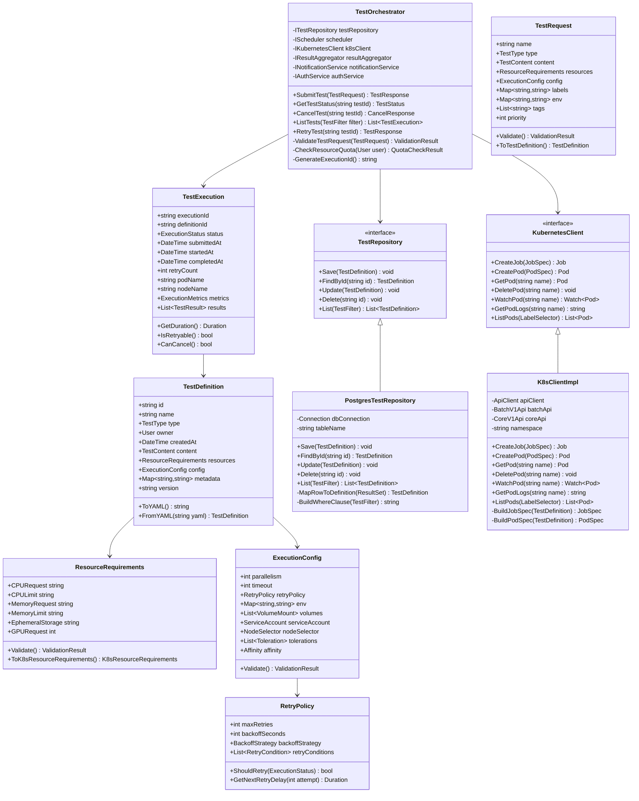
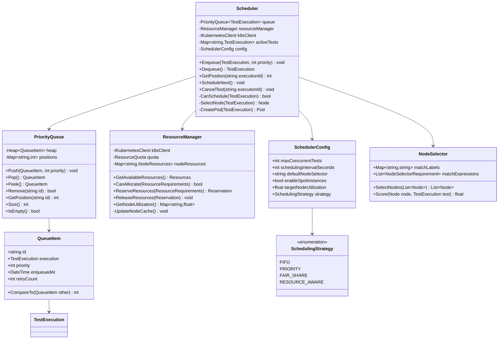
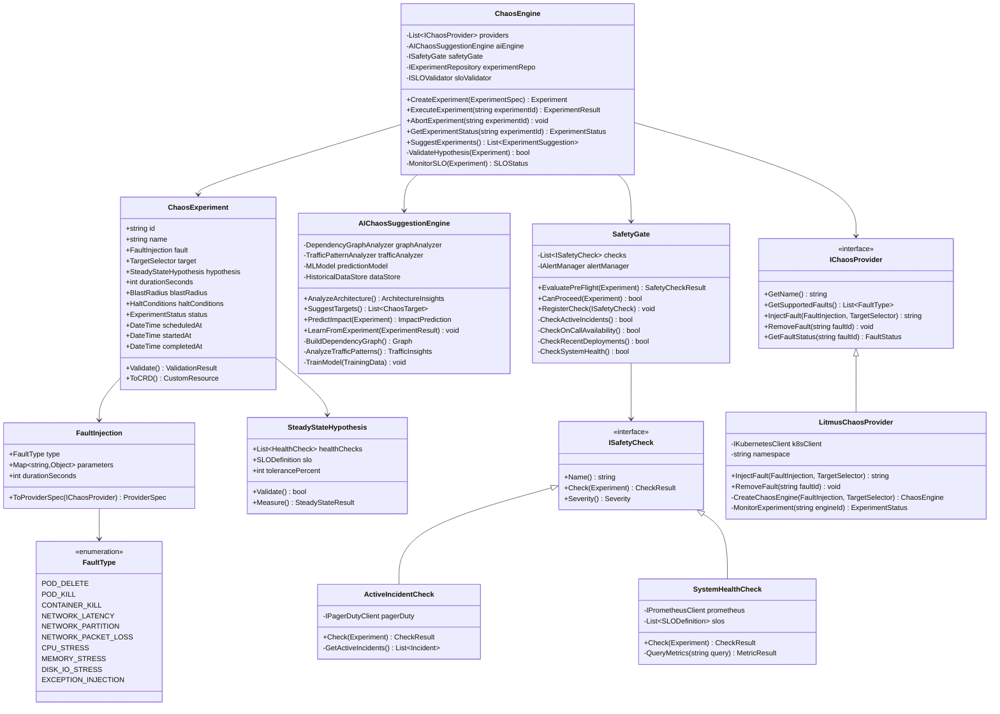
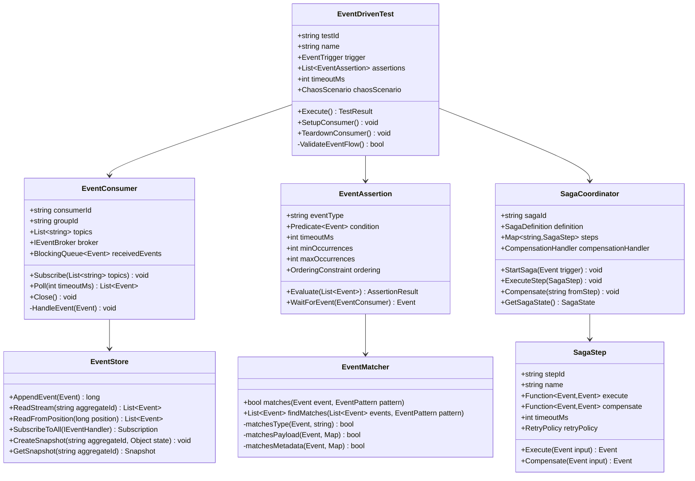
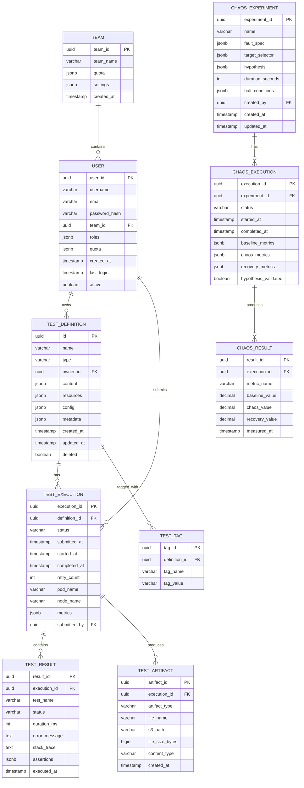

# Low-Level Design (LLD)
## Enterprise Test Automation Architectures - Detailed Component Design

---

## Table of Contents
1. [Test Orchestrator Service - Detailed Design](#orchestrator)
2. [Test Scheduler - Detailed Design](#scheduler)
3. [Chaos Engine - Detailed Design](#chaos-engine)
4. [Event-Driven Test Framework - Detailed Design](#event-framework)
5. [Database Schema Design](#database-schema)
6. [API Specifications](#api-specs)
7. [Algorithms & Data Structures](#algorithms)

---

## 1. Test Orchestrator Service - Detailed Design {#orchestrator}

### 1.1 Class Diagram



### 1.2 API Specification

#### 1.2.1 Submit Test API

**Endpoint**: `POST /api/v1/tests`

**Request**:
```json
{
  "name": "API Regression Test Suite",
  "type": "postman",
  "content": {
    "type": "git",
    "repository": "https://github.com/company/tests.git",
    "branch": "main",
    "path": "api-tests/collection.json"
  },
  "resources": {
    "cpuRequest": "500m",
    "cpuLimit": "1000m",
    "memoryRequest": "512Mi",
    "memoryLimit": "1Gi"
  },
  "config": {
    "parallelism": 10,
    "timeout": 3600,
    "retryPolicy": {
      "maxRetries": 3,
      "backoffSeconds": 30,
      "backoffStrategy": "exponential"
    },
    "env": {
      "API_BASE_URL": "https://staging.example.com",
      "API_KEY": "${secrets.api_key}"
    }
  },
  "labels": {
    "team": "backend",
    "environment": "staging"
  },
  "priority": 1
}
```

**Response** (202 Accepted):
```json
{
  "executionId": "exec-a1b2c3d4",
  "status": "queued",
  "queuePosition": 5,
  "estimatedStartTime": "2025-01-01T10:35:00Z",
  "links": {
    "self": "/api/v1/tests/exec-a1b2c3d4",
    "logs": "/api/v1/tests/exec-a1b2c3d4/logs",
    "cancel": "/api/v1/tests/exec-a1b2c3d4/cancel"
  }
}
```

#### 1.2.2 Get Test Status API

**Endpoint**: `GET /api/v1/tests/{executionId}`

**Response**:
```json
{
  "executionId": "exec-a1b2c3d4",
  "name": "API Regression Test Suite",
  "status": "running",
  "submittedAt": "2025-01-01T10:30:00Z",
  "startedAt": "2025-01-01T10:35:00Z",
  "progress": {
    "totalTests": 250,
    "completed": 150,
    "passed": 145,
    "failed": 5,
    "skipped": 0,
    "percentComplete": 60
  },
  "resources": {
    "podName": "test-exec-a1b2c3d4-abc123",
    "nodeName": "ip-10-0-1-50.ec2.internal",
    "cpuUsage": "750m",
    "memoryUsage": "800Mi"
  },
  "links": {
    "logs": "/api/v1/tests/exec-a1b2c3d4/logs",
    "metrics": "/api/v1/tests/exec-a1b2c3d4/metrics"
  }
}
```

### 1.3 Core Algorithm: Test Submission Workflow

```python
def submit_test(test_request: TestRequest, user: User) -> TestResponse:
    """
    Submit a test for execution.

    Algorithm:
    1. Validate request
    2. Check user quota
    3. Create test definition
    4. Enqueue test
    5. Return response

    Time Complexity: O(1)
    Space Complexity: O(1)
    """
    # Step 1: Validate request
    validation_result = test_request.validate()
    if not validation_result.is_valid:
        raise ValidationError(validation_result.errors)

    # Step 2: Check resource quota
    quota_result = check_resource_quota(user)
    if not quota_result.within_quota:
        raise QuotaExceededError(
            f"User {user.id} has exceeded quota. "
            f"Current: {quota_result.current}, Limit: {quota_result.limit}"
        )

    # Step 3: Create test definition
    test_definition = TestDefinition(
        id=generate_id(),
        name=test_request.name,
        type=test_request.type,
        owner=user,
        created_at=datetime.utcnow(),
        content=test_request.content,
        resources=test_request.resources,
        config=test_request.config,
        metadata={
            "labels": test_request.labels,
            "tags": test_request.tags,
            "priority": test_request.priority
        }
    )

    # Save to database
    test_repository.save(test_definition)

    # Step 4: Create execution record
    execution = TestExecution(
        execution_id=generate_execution_id(),
        definition_id=test_definition.id,
        status=ExecutionStatus.QUEUED,
        submitted_at=datetime.utcnow(),
        retry_count=0
    )

    execution_repository.save(execution)

    # Step 5: Enqueue test with priority
    scheduler.enqueue(execution, priority=test_request.priority)

    # Step 6: Return response
    queue_position = scheduler.get_position(execution.execution_id)
    estimated_start = estimate_start_time(queue_position)

    return TestResponse(
        execution_id=execution.execution_id,
        status=execution.status,
        queue_position=queue_position,
        estimated_start_time=estimated_start
    )
```

---

## 2. Test Scheduler - Detailed Design {#scheduler}

### 2.1 Class Diagram



### 2.2 Core Algorithm: Priority-Based Scheduling

```python
class PriorityScheduler:
    """
    Priority-based test scheduler with resource awareness.

    Algorithm: Priority Queue + Resource Bin Packing
    Time Complexity: O(log n) for enqueue/dequeue
    Space Complexity: O(n) where n is number of queued tests
    """

    def __init__(self):
        self.queue = []  # Min heap: (priority, enqueued_at, execution)
        self.active_tests = {}  # execution_id -> TestExecution
        self.resource_manager = ResourceManager()
        self.max_concurrent = 100

    def enqueue(self, execution: TestExecution, priority: int):
        """
        Enqueue a test with given priority.
        Lower priority number = higher priority (0 is highest)

        Time Complexity: O(log n)
        """
        import heapq

        # Create queue item with priority, timestamp for FIFO within same priority
        queue_item = (
            priority,                    # Primary sort: priority
            execution.submitted_at,      # Secondary sort: FIFO
            execution.execution_id,      # Tie-breaker: unique ID
            execution
        )

        heapq.heappush(self.queue, queue_item)

        logger.info(
            f"Enqueued test {execution.execution_id} "
            f"with priority {priority}, queue depth: {len(self.queue)}"
        )

    def schedule_next(self):
        """
        Schedule next test from queue if resources available.

        Algorithm:
        1. Check if we can schedule more tests (concurrent limit)
        2. Peek at highest priority test
        3. Check resource availability
        4. If resources available: dequeue and schedule
        5. If resources unavailable: wait for resources to free up

        Time Complexity: O(log n + m) where m is number of nodes
        """
        import heapq

        # Check concurrent test limit
        if len(self.active_tests) >= self.max_concurrent:
            logger.debug(f"Max concurrent tests reached: {self.max_concurrent}")
            return

        # Check if queue has tests
        if not self.queue:
            logger.debug("Queue is empty")
            return

        # Peek at highest priority test
        priority, submitted_at, exec_id, execution = self.queue[0]

        # Check resource availability
        required_resources = execution.definition.resources
        available = self.resource_manager.can_allocate(required_resources)

        if not available:
            logger.info(
                f"Insufficient resources for test {exec_id}. "
                f"Waiting for resources to free up."
            )
            return

        # Dequeue test
        heapq.heappop(self.queue)

        # Select best node for test
        node = self.select_node(execution)

        # Create Kubernetes pod
        pod_spec = self.build_pod_spec(execution, node)
        pod = self.k8s_client.create_pod(pod_spec)

        # Update execution record
        execution.status = ExecutionStatus.RUNNING
        execution.started_at = datetime.utcnow()
        execution.pod_name = pod.metadata.name
        execution.node_name = node.name

        # Add to active tests
        self.active_tests[exec_id] = execution

        # Reserve resources
        self.resource_manager.reserve_resources(
            execution_id=exec_id,
            resources=required_resources,
            node=node
        )

        logger.info(
            f"Scheduled test {exec_id} on node {node.name}, "
            f"pod: {pod.metadata.name}"
        )

    def select_node(self, execution: TestExecution) -> Node:
        """
        Select best node for test execution.

        Algorithm: Weighted Scoring
        - Available resources: 40%
        - Node utilization (prefer balanced): 30%
        - Affinity/anti-affinity: 20%
        - Spot instance cost savings: 10%

        Time Complexity: O(m) where m is number of nodes
        """
        nodes = self.k8s_client.list_nodes()

        # Filter nodes based on selector
        node_selector = execution.definition.config.node_selector
        if node_selector:
            nodes = [n for n in nodes if self.matches_selector(n, node_selector)]

        if not nodes:
            raise NoNodesAvailableError("No nodes match selector")

        # Score each node
        scored_nodes = []
        for node in nodes:
            score = self.score_node(node, execution)
            scored_nodes.append((score, node))

        # Sort by score (descending) and return best node
        scored_nodes.sort(reverse=True, key=lambda x: x[0])
        best_node = scored_nodes[0][1]

        return best_node

    def score_node(self, node: Node, execution: TestExecution) -> float:
        """
        Calculate score for a node (0.0 to 1.0, higher is better).
        """
        # Get node resources
        allocatable = node.status.allocatable
        allocated = self.resource_manager.get_allocated(node.name)

        # Calculate available resources
        cpu_available = allocatable.cpu - allocated.cpu
        mem_available = allocatable.memory - allocated.memory

        # Required resources
        cpu_required = execution.definition.resources.cpu_request
        mem_required = execution.definition.resources.memory_request

        # Score component 1: Resource availability (40%)
        cpu_fit_score = cpu_available / cpu_required if cpu_required > 0 else 1.0
        mem_fit_score = mem_available / mem_required if mem_required > 0 else 1.0
        resource_score = min(cpu_fit_score, mem_fit_score) * 0.4

        # Score component 2: Node utilization - prefer balanced (30%)
        cpu_util = allocated.cpu / allocatable.cpu
        mem_util = allocated.memory / allocatable.memory
        avg_util = (cpu_util + mem_util) / 2.0
        # Prefer utilization between 60-80%
        target_util = 0.7
        utilization_score = (1.0 - abs(avg_util - target_util)) * 0.3

        # Score component 3: Affinity (20%)
        affinity_score = self.calculate_affinity_score(node, execution) * 0.2

        # Score component 4: Cost (spot instances get bonus) (10%)
        cost_score = 0.1 if node.labels.get("spot") == "true" else 0.05

        total_score = resource_score + utilization_score + affinity_score + cost_score

        return total_score
```

### 2.3 Data Structure: Min-Heap Priority Queue

```python
class PriorityQueue:
    """
    Min-heap based priority queue.

    Operations:
    - push: O(log n)
    - pop: O(log n)
    - peek: O(1)
    - remove: O(n)
    """

    def __init__(self):
        self.heap = []
        self.entry_finder = {}  # id -> (priority, count, item)
        self.counter = itertools.count()

    def push(self, item: QueueItem, priority: int):
        """Add item to queue with given priority."""
        if item.id in self.entry_finder:
            self.remove(item.id)

        count = next(self.counter)
        entry = [priority, count, item]
        self.entry_finder[item.id] = entry
        heapq.heappush(self.heap, entry)

    def pop(self) -> QueueItem:
        """Remove and return highest priority item."""
        while self.heap:
            priority, count, item = heapq.heappop(self.heap)
            if item is not None:
                del self.entry_finder[item.id]
                return item
        raise IndexError("pop from empty priority queue")

    def peek(self) -> QueueItem:
        """Return highest priority item without removing."""
        while self.heap:
            priority, count, item = self.heap[0]
            if item is not None:
                return item
            heapq.heappop(self.heap)
        raise IndexError("peek from empty priority queue")

    def remove(self, item_id: str):
        """Mark item as removed (lazy deletion)."""
        entry = self.entry_finder.pop(item_id)
        entry[-1] = None  # Mark as removed
```

---

## 3. Chaos Engine - Detailed Design {#chaos-engine}

### 3.1 Class Diagram



### 3.2 AI Target Selection Algorithm

```python
class AIChaosSuggestionEngine:
    """
    AI-powered chaos target selection using graph analysis and ML.

    Algorithms:
    1. Dependency Graph Analysis (PageRank)
    2. Traffic Pattern Analysis (Time Series)
    3. Impact Prediction (Random Forest Classifier)
    """

    def suggest_chaos_targets(self) -> List[ChaosTarget]:
        """
        Suggest chaos engineering targets using AI.

        Algorithm:
        1. Build service dependency graph from Istio telemetry
        2. Calculate centrality metrics (PageRank, betweenness)
        3. Analyze traffic patterns
        4. Rank targets by impact potential
        5. Filter by safety constraints

        Time Complexity: O(V + E) for graph analysis, O(n log n) for ranking
        """
        # Step 1: Build dependency graph
        graph = self.build_dependency_graph()

        # Step 2: Calculate centrality metrics
        pagerank_scores = self.calculate_pagerank(graph)
        betweenness_scores = self.calculate_betweenness_centrality(graph)

        # Step 3: Analyze traffic patterns
        traffic_insights = self.analyze_traffic_patterns()

        # Step 4: Score each service
        targets = []
        for service in graph.nodes():
            score = self.calculate_target_score(
                service=service,
                pagerank=pagerank_scores[service],
                betweenness=betweenness_scores[service],
                traffic=traffic_insights[service]
            )

            # Predict impact
            impact = self.predict_impact(service)

            targets.append(ChaosTarget(
                service=service,
                score=score,
                predicted_impact=impact,
                recommended_faults=self.recommend_faults(service)
            ))

        # Step 5: Sort by score and return top N
        targets.sort(key=lambda t: t.score, reverse=True)

        return targets[:10]  # Top 10 targets

    def build_dependency_graph(self) -> networkx.DiGraph:
        """
        Build service dependency graph from Istio metrics.

        Algorithm: Query Prometheus for istio_request_total metrics
        """
        import networkx as nx

        graph = nx.DiGraph()

        # Query Prometheus for service-to-service calls
        query = '''
            sum by (source_workload, destination_workload) (
                rate(istio_requests_total[5m])
            )
        '''

        result = self.prometheus_client.query(query)

        for metric in result:
            source = metric['metric']['source_workload']
            destination = metric['metric']['destination_workload']
            rate = float(metric['value'][1])

            # Add edge with weight = request rate
            graph.add_edge(source, destination, weight=rate)

        return graph

    def calculate_pagerank(self, graph: networkx.DiGraph) -> Dict[str, float]:
        """
        Calculate PageRank for each service.
        Services with high PageRank are critical in the dependency graph.

        Algorithm: PageRank (iterative)
        Time Complexity: O(k(V + E)) where k is iterations
        """
        import networkx as nx

        pagerank = nx.pagerank(
            graph,
            alpha=0.85,
            max_iter=100,
            tol=1e-6
        )

        return pagerank

    def predict_impact(self, service: str) -> ImpactPrediction:
        """
        Predict impact of chaos on a service using ML.

        Model: Random Forest Classifier
        Features:
        - Service centrality metrics
        - Historical incident data
        - Traffic patterns
        - SLO margins

        Time Complexity: O(n_trees * log(n_samples))
        """
        # Extract features
        features = self.extract_features(service)

        # Predict using trained model
        prediction = self.ml_model.predict_proba([features])[0]

        # Classes: [low_impact, medium_impact, high_impact]
        impact_prediction = ImpactPrediction(
            service=service,
            low_impact_prob=prediction[0],
            medium_impact_prob=prediction[1],
            high_impact_prob=prediction[2],
            estimated_affected_users=self.estimate_affected_users(service),
            estimated_error_rate_increase=self.estimate_error_rate(service)
        )

        return impact_prediction

    def extract_features(self, service: str) -> List[float]:
        """Extract ML features for a service."""
        features = [
            self.pagerank_scores.get(service, 0.0),
            self.betweenness_scores.get(service, 0.0),
            self.traffic_insights[service]['requests_per_second'],
            self.traffic_insights[service]['error_rate'],
            self.traffic_insights[service]['p99_latency'],
            len(self.get_dependencies(service)),  # Number of dependencies
            len(self.get_dependents(service)),    # Number of dependents
            self.get_slo_margin(service),         # Current SLO margin
            self.get_incident_count(service, days=30)  # Incidents in last 30 days
        ]

        return features
```

---

## 4. Event-Driven Test Framework - Detailed Design {#event-framework}

### 4.1 Class Diagram



### 4.2 Event Consumer Implementation

```python
class KafkaEventConsumer:
    """
    Kafka event consumer for test framework.

    Responsibilities:
    - Subscribe to topics
    - Consume events
    - Maintain event order
    - Handle rebalancing
    """

    def __init__(self, group_id: str, topics: List[str], config: dict):
        self.group_id = group_id
        self.topics = topics
        self.consumer = KafkaConsumer(
            *topics,
            bootstrap_servers=config['bootstrap_servers'],
            group_id=group_id,
            auto_offset_reset='earliest',
            enable_auto_commit=False,
            value_deserializer=lambda m: json.loads(m.decode('utf-8')),
            key_deserializer=lambda m: m.decode('utf-8') if m else None
        )
        self.received_events = []
        self.running = False

    def start(self):
        """Start consuming events."""
        self.running = True
        self.consume_thread = threading.Thread(target=self._consume_loop)
        self.consume_thread.start()

    def _consume_loop(self):
        """Main consume loop."""
        while self.running:
            # Poll for messages with 1 second timeout
            messages = self.consumer.poll(timeout_ms=1000)

            for topic_partition, records in messages.items():
                for record in records:
                    event = self._parse_event(record)
                    self.received_events.append(event)

                    logger.debug(
                        f"Consumed event: type={event.type}, "
                        f"aggregate_id={event.aggregate_id}"
                    )

            # Commit offsets
            self.consumer.commit()

    def wait_for_event(
        self,
        event_type: str,
        condition: Callable[[Event], bool],
        timeout_ms: int
    ) -> Optional[Event]:
        """
        Wait for specific event matching condition.

        Algorithm: Linear search with timeout
        Time Complexity: O(n) where n is number of received events
        """
        start_time = time.time()
        timeout_seconds = timeout_ms / 1000.0

        while (time.time() - start_time) < timeout_seconds:
            # Search received events
            for event in self.received_events:
                if event.type == event_type and condition(event):
                    return event

            # Wait a bit before checking again
            time.sleep(0.1)

        # Timeout reached
        return None

    def get_events_in_order(
        self,
        event_types: List[str],
        timeout_ms: int
    ) -> List[Event]:
        """
        Get events in specified order.

        Algorithm: Pattern matching with timeout
        Returns: List of events if pattern matched, empty list otherwise
        """
        start_time = time.time()
        timeout_seconds = timeout_ms / 1000.0

        matched_events = []
        current_type_index = 0

        while (time.time() - start_time) < timeout_seconds:
            if current_type_index >= len(event_types):
                # All events matched!
                return matched_events

            expected_type = event_types[current_type_index]

            # Look for next expected event
            for i, event in enumerate(self.received_events):
                if i < len(matched_events):
                    continue  # Already matched

                if event.type == expected_type:
                    matched_events.append(event)
                    current_type_index += 1
                    break

            time.sleep(0.1)

        # Timeout or partial match
        return matched_events if len(matched_events) == len(event_types) else []
```

### 4.3 Saga Testing Algorithm

```python
def test_order_saga_with_compensation():
    """
    Test saga pattern with compensation.

    Scenario: Order -> Payment Fails -> Compensation

    Expected Event Flow:
    1. OrderCreated
    2. InventoryReserved
    3. PaymentFailed (chaos injected)
    4. InventoryReleased (compensation)
    5. OrderCancelled (compensation)
    """
    # Setup event consumer
    consumer = KafkaEventConsumer(
        group_id='test-saga-consumer',
        topics=['orders', 'inventory', 'payments']
    )
    consumer.start()

    # Inject chaos: Kill payment service before test
    chaos_engine.inject_fault(
        fault_type=FaultType.POD_KILL,
        target={'service': 'payment-service'},
        duration_seconds=60
    )

    # Trigger saga
    order_id = str(uuid.uuid4())
    response = requests.post('http://order-service/orders', json={
        'order_id': order_id,
        'items': [{'sku': 'ABC123', 'quantity': 2}]
    })

    assert response.status_code == 202  # Accepted

    # Wait for event sequence
    timeout_ms = 10000  # 10 seconds

    # Assert event 1: OrderCreated
    order_created = consumer.wait_for_event(
        event_type='OrderCreated',
        condition=lambda e: e.payload['order_id'] == order_id,
        timeout_ms=timeout_ms
    )
    assert order_created is not None, "OrderCreated event not received"

    # Assert event 2: InventoryReserved
    inventory_reserved = consumer.wait_for_event(
        event_type='InventoryReserved',
        condition=lambda e: e.payload['order_id'] == order_id,
        timeout_ms=timeout_ms
    )
    assert inventory_reserved is not None, "InventoryReserved event not received"

    # Assert event 3: PaymentFailed (due to chaos)
    payment_failed = consumer.wait_for_event(
        event_type='PaymentFailed',
        condition=lambda e: e.payload['order_id'] == order_id,
        timeout_ms=timeout_ms
    )
    assert payment_failed is not None, "PaymentFailed event not received"
    assert 'service unavailable' in payment_failed.payload.get('reason', '').lower()

    # Assert event 4: InventoryReleased (compensation)
    inventory_released = consumer.wait_for_event(
        event_type='InventoryReleased',
        condition=lambda e: e.payload['order_id'] == order_id,
        timeout_ms=timeout_ms
    )
    assert inventory_released is not None, "InventoryReleased event not received"

    # Assert event 5: OrderCancelled (compensation)
    order_cancelled = consumer.wait_for_event(
        event_type='OrderCancelled',
        condition=lambda e: e.payload['order_id'] == order_id,
        timeout_ms=timeout_ms
    )
    assert order_cancelled is not None, "OrderCancelled event not received"

    # Verify event ordering
    all_events = consumer.received_events
    event_order = [e.type for e in all_events if e.aggregate_id == order_id]

    expected_order = [
        'OrderCreated',
        'InventoryReserved',
        'PaymentFailed',
        'InventoryReleased',
        'OrderCancelled'
    ]

    assert event_order == expected_order, \
        f"Event order mismatch. Expected: {expected_order}, Actual: {event_order}"

    # Verify idempotency: No duplicate events
    event_types = [e.type for e in all_events if e.aggregate_id == order_id]
    assert len(event_types) == len(set(event_types)), "Duplicate events detected"

    # Clean up
    consumer.stop()
    chaos_engine.remove_fault()

    logger.info("✓ Saga compensation test passed")
```

---

## 5. Database Schema Design {#database-schema}

### 5.1 Entity-Relationship Diagram



### 5.2 Table Definitions (PostgreSQL)

```sql
-- Test Definitions Table
CREATE TABLE test_definitions (
    id UUID PRIMARY KEY DEFAULT gen_random_uuid(),
    name VARCHAR(255) NOT NULL,
    type VARCHAR(50) NOT NULL,  -- 'selenium', 'postman', 'k6', etc.
    owner_id UUID NOT NULL REFERENCES users(user_id),
    content JSONB NOT NULL,  -- Git repo, inline script, or artifact URL
    resources JSONB NOT NULL,  -- CPU, memory, etc.
    config JSONB NOT NULL,  -- Parallelism, timeout, retry policy, etc.
    metadata JSONB,  -- Labels, tags, priority
    created_at TIMESTAMP DEFAULT NOW(),
    updated_at TIMESTAMP DEFAULT NOW(),
    deleted BOOLEAN DEFAULT FALSE,

    CONSTRAINT valid_type CHECK (type IN ('selenium', 'cypress', 'postman', 'k6', 'playwright', 'custom'))
);

CREATE INDEX idx_test_definitions_owner ON test_definitions(owner_id) WHERE deleted = FALSE;
CREATE INDEX idx_test_definitions_type ON test_definitions(type) WHERE deleted = FALSE;
CREATE INDEX idx_test_definitions_metadata ON test_definitions USING GIN(metadata);

-- Test Executions Table
CREATE TABLE test_executions (
    execution_id UUID PRIMARY KEY DEFAULT gen_random_uuid(),
    definition_id UUID NOT NULL REFERENCES test_definitions(id),
    status VARCHAR(50) NOT NULL,  -- 'queued', 'running', 'completed', 'failed', 'cancelled'
    submitted_at TIMESTAMP DEFAULT NOW(),
    started_at TIMESTAMP,
    completed_at TIMESTAMP,
    retry_count INT DEFAULT 0,
    pod_name VARCHAR(255),
    node_name VARCHAR(255),
    metrics JSONB,  -- CPU usage, memory usage, duration, etc.
    submitted_by UUID NOT NULL REFERENCES users(user_id),

    CONSTRAINT valid_status CHECK (status IN ('queued', 'running', 'completed', 'failed', 'cancelled', 'timeout'))
);

CREATE INDEX idx_test_executions_definition ON test_executions(definition_id);
CREATE INDEX idx_test_executions_status ON test_executions(status);
CREATE INDEX idx_test_executions_submitted_at ON test_executions(submitted_at DESC);
CREATE INDEX idx_test_executions_user ON test_executions(submitted_by);

-- Test Results Table
CREATE TABLE test_results (
    result_id UUID PRIMARY KEY DEFAULT gen_random_uuid(),
    execution_id UUID NOT NULL REFERENCES test_executions(execution_id) ON DELETE CASCADE,
    test_name VARCHAR(500) NOT NULL,
    status VARCHAR(20) NOT NULL,  -- 'passed', 'failed', 'skipped'
    duration_ms INT NOT NULL,
    error_message TEXT,
    stack_trace TEXT,
    assertions JSONB,  -- List of assertion results
    executed_at TIMESTAMP DEFAULT NOW(),

    CONSTRAINT valid_result_status CHECK (status IN ('passed', 'failed', 'skipped'))
);

CREATE INDEX idx_test_results_execution ON test_results(execution_id);
CREATE INDEX idx_test_results_status ON test_results(status);

-- Test Artifacts Table
CREATE TABLE test_artifacts (
    artifact_id UUID PRIMARY KEY DEFAULT gen_random_uuid(),
    execution_id UUID NOT NULL REFERENCES test_executions(execution_id) ON DELETE CASCADE,
    artifact_type VARCHAR(50) NOT NULL,  -- 'screenshot', 'video', 'log', 'report'
    file_name VARCHAR(500) NOT NULL,
    s3_path VARCHAR(1000) NOT NULL,  -- Full S3 path
    file_size_bytes BIGINT NOT NULL,
    content_type VARCHAR(100),
    created_at TIMESTAMP DEFAULT NOW(),

    CONSTRAINT valid_artifact_type CHECK (artifact_type IN ('screenshot', 'video', 'log', 'report', 'other'))
);

CREATE INDEX idx_test_artifacts_execution ON test_artifacts(execution_id);
CREATE INDEX idx_test_artifacts_type ON test_artifacts(artifact_type);

-- Users Table
CREATE TABLE users (
    user_id UUID PRIMARY KEY DEFAULT gen_random_uuid(),
    username VARCHAR(100) UNIQUE NOT NULL,
    email VARCHAR(255) UNIQUE NOT NULL,
    password_hash VARCHAR(255) NOT NULL,
    team_id UUID REFERENCES teams(team_id),
    roles JSONB DEFAULT '[]'::jsonb,  -- ['admin', 'user', 'viewer']
    quota JSONB DEFAULT '{"max_concurrent_tests": 10, "max_daily_tests": 100}'::jsonb,
    created_at TIMESTAMP DEFAULT NOW(),
    last_login TIMESTAMP,
    active BOOLEAN DEFAULT TRUE
);

CREATE INDEX idx_users_email ON users(email);
CREATE INDEX idx_users_team ON users(team_id);

-- Teams Table
CREATE TABLE teams (
    team_id UUID PRIMARY KEY DEFAULT gen_random_uuid(),
    team_name VARCHAR(100) UNIQUE NOT NULL,
    quota JSONB DEFAULT '{"max_concurrent_tests": 50, "max_daily_tests": 1000}'::jsonb,
    settings JSONB DEFAULT '{}'::jsonb,
    created_at TIMESTAMP DEFAULT NOW()
);

-- Chaos Experiments Table
CREATE TABLE chaos_experiments (
    experiment_id UUID PRIMARY KEY DEFAULT gen_random_uuid(),
    name VARCHAR(255) NOT NULL,
    fault_spec JSONB NOT NULL,  -- Type, parameters, duration
    target_selector JSONB NOT NULL,  -- Namespace, labels, service
    hypothesis JSONB NOT NULL,  -- SLO definitions, health checks
    duration_seconds INT NOT NULL,
    halt_conditions JSONB,  -- Auto-abort conditions
    created_by UUID NOT NULL REFERENCES users(user_id),
    created_at TIMESTAMP DEFAULT NOW(),
    updated_at TIMESTAMP DEFAULT NOW()
);

CREATE INDEX idx_chaos_experiments_creator ON chaos_experiments(created_by);

-- Chaos Executions Table
CREATE TABLE chaos_executions (
    execution_id UUID PRIMARY KEY DEFAULT gen_random_uuid(),
    experiment_id UUID NOT NULL REFERENCES chaos_experiments(experiment_id),
    status VARCHAR(50) NOT NULL,  -- 'scheduled', 'running', 'completed', 'aborted', 'failed'
    started_at TIMESTAMP,
    completed_at TIMESTAMP,
    baseline_metrics JSONB,  -- Metrics before chaos
    chaos_metrics JSONB,  -- Metrics during chaos
    recovery_metrics JSONB,  -- Metrics after chaos
    hypothesis_validated BOOLEAN,

    CONSTRAINT valid_chaos_status CHECK (status IN ('scheduled', 'running', 'completed', 'aborted', 'failed'))
);

CREATE INDEX idx_chaos_executions_experiment ON chaos_executions(experiment_id);
CREATE INDEX idx_chaos_executions_status ON chaos_executions(status);
```

### 5.3 Sample Queries

```sql
-- Get test execution statistics for last 24 hours
SELECT
    td.type,
    COUNT(*) as total_executions,
    COUNT(*) FILTER (WHERE te.status = 'completed') as completed,
    COUNT(*) FILTER (WHERE te.status = 'failed') as failed,
    AVG(EXTRACT(EPOCH FROM (te.completed_at - te.started_at))) as avg_duration_seconds
FROM test_executions te
JOIN test_definitions td ON te.definition_id = td.id
WHERE te.submitted_at >= NOW() - INTERVAL '24 hours'
GROUP BY td.type;

-- Get flaky tests (tests with inconsistent results)
WITH test_stats AS (
    SELECT
        tr.test_name,
        COUNT(*) as total_runs,
        COUNT(*) FILTER (WHERE tr.status = 'passed') as passes,
        COUNT(*) FILTER (WHERE tr.status = 'failed') as failures
    FROM test_results tr
    JOIN test_executions te ON tr.execution_id = te.execution_id
    WHERE te.submitted_at >= NOW() - INTERVAL '7 days'
    GROUP BY tr.test_name
)
SELECT
    test_name,
    total_runs,
    passes,
    failures,
    ROUND((failures::decimal / total_runs) * 100, 2) as failure_rate
FROM test_stats
WHERE failures > 0 AND passes > 0  -- Has both passes and failures
ORDER BY failure_rate DESC
LIMIT 20;

-- Get user test execution quota usage
SELECT
    u.username,
    u.quota->>'max_daily_tests' as daily_limit,
    COUNT(*) as tests_today,
    (u.quota->>'max_daily_tests')::int - COUNT(*) as remaining
FROM users u
LEFT JOIN test_executions te ON u.user_id = te.submitted_by
    AND te.submitted_at >= CURRENT_DATE
GROUP BY u.user_id, u.username, u.quota;
```

---

## 6. API Specifications {#api-specs}

### 6.1 OpenAPI Specification (Excerpt)

```yaml
openapi: 3.0.3
info:
  title: Test Orchestration API
  version: 1.0.0
  description: API for managing test executions

servers:
  - url: https://test-platform.example.com/api/v1

paths:
  /tests:
    post:
      summary: Submit a test for execution
      requestBody:
        required: true
        content:
          application/json:
            schema:
              $ref: '#/components/schemas/TestRequest'
      responses:
        '202':
          description: Test accepted for execution
          content:
            application/json:
              schema:
                $ref: '#/components/schemas/TestResponse'
        '400':
          description: Invalid request
        '401':
          description: Unauthorized
        '429':
          description: Quota exceeded

    get:
      summary: List test executions
      parameters:
        - name: status
          in: query
          schema:
            type: string
            enum: [queued, running, completed, failed, cancelled]
        - name: limit
          in: query
          schema:
            type: integer
            default: 20
        - name: offset
          in: query
          schema:
            type: integer
            default: 0
      responses:
        '200':
          description: List of test executions
          content:
            application/json:
              schema:
                type: object
                properties:
                  executions:
                    type: array
                    items:
                      $ref: '#/components/schemas/TestExecution'
                  total:
                    type: integer
                  limit:
                    type: integer
                  offset:
                    type: integer

  /tests/{executionId}:
    get:
      summary: Get test execution status
      parameters:
        - name: executionId
          in: path
          required: true
          schema:
            type: string
            format: uuid
      responses:
        '200':
          description: Test execution details
          content:
            application/json:
              schema:
                $ref: '#/components/schemas/TestExecution'
        '404':
          description: Test not found

components:
  schemas:
    TestRequest:
      type: object
      required:
        - name
        - type
        - content
      properties:
        name:
          type: string
          example: "API Regression Test"
        type:
          type: string
          enum: [selenium, cypress, postman, k6, playwright]
        content:
          oneOf:
            - $ref: '#/components/schemas/GitContent'
            - $ref: '#/components/schemas/InlineContent'
        resources:
          $ref: '#/components/schemas/ResourceRequirements'
        config:
          $ref: '#/components/schemas/ExecutionConfig'
        labels:
          type: object
          additionalProperties:
            type: string
        priority:
          type: integer
          minimum: 0
          maximum: 9
          default: 5
```

---

## Summary

This LLD document provides:
- ✅ Detailed class diagrams for all major components
- ✅ Concrete algorithm implementations with complexity analysis
- ✅ Database schema design with ER diagrams
- ✅ API specifications (OpenAPI)
- ✅ Code-level implementation details
- ✅ Data structures and their operations
- ✅ SQL queries and table definitions

**Next Steps**: Create additional sequence diagrams and ER diagrams in a separate document.
