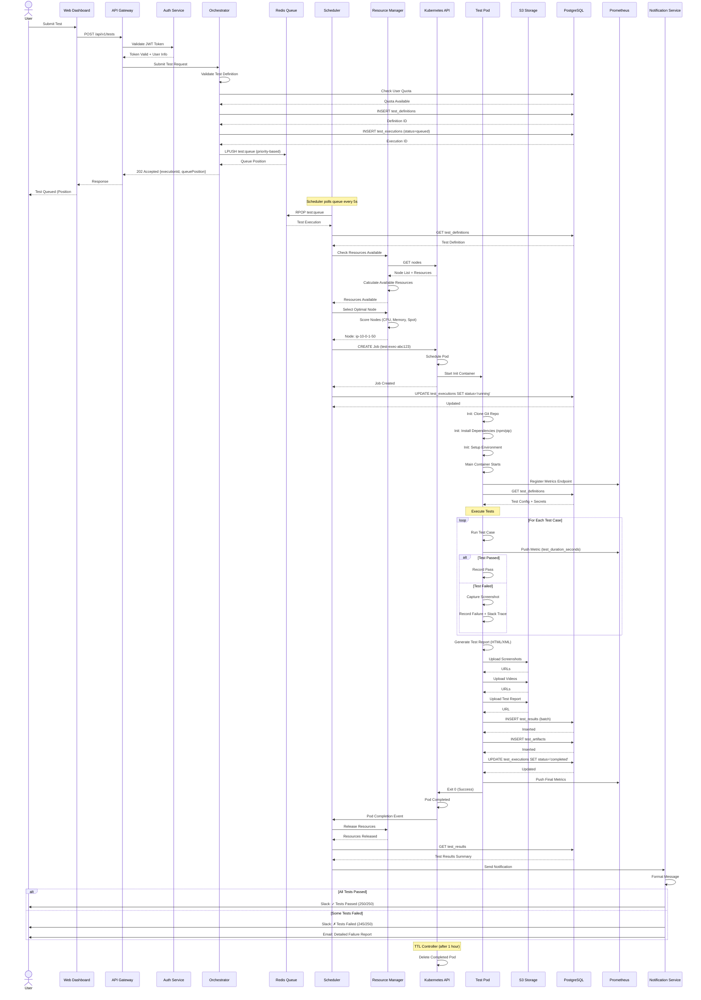
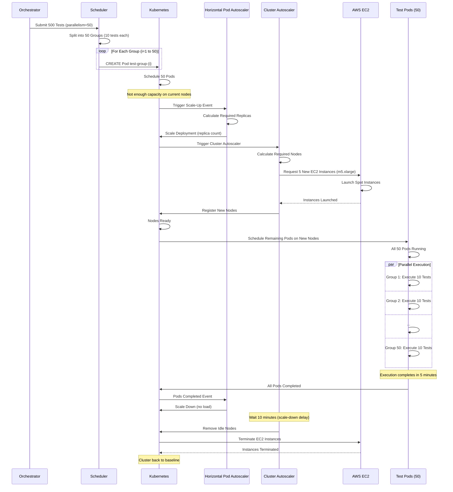
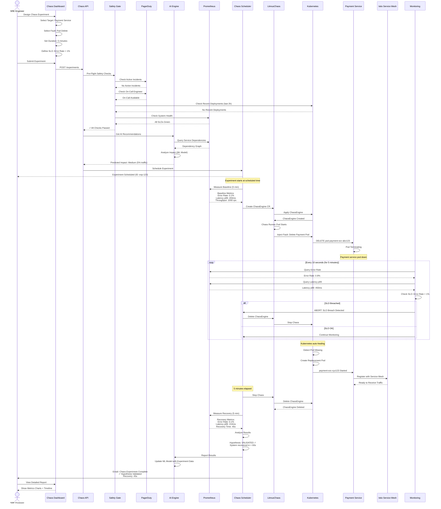
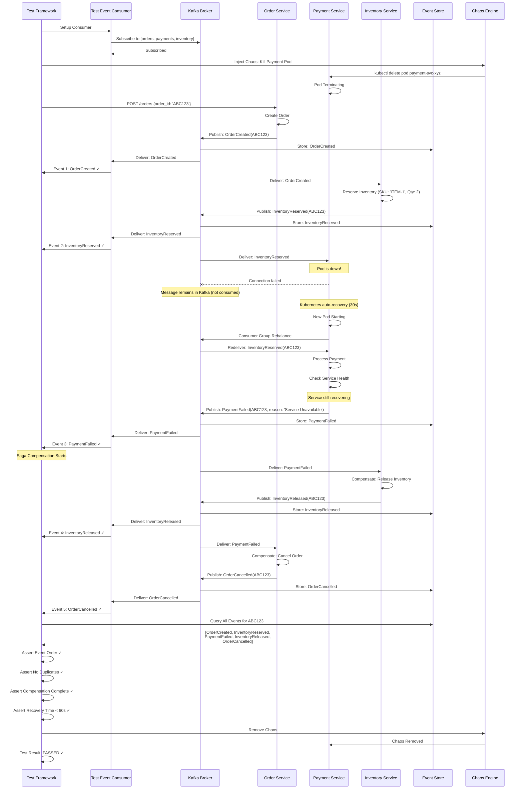
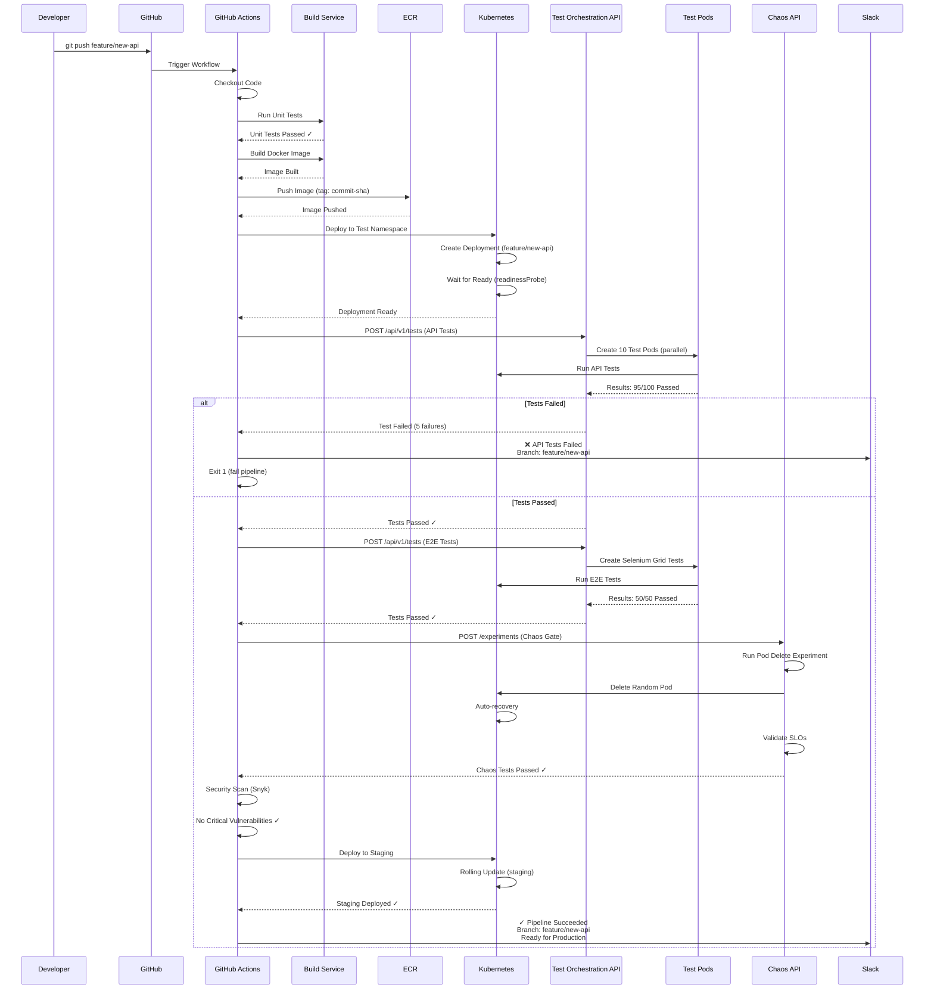
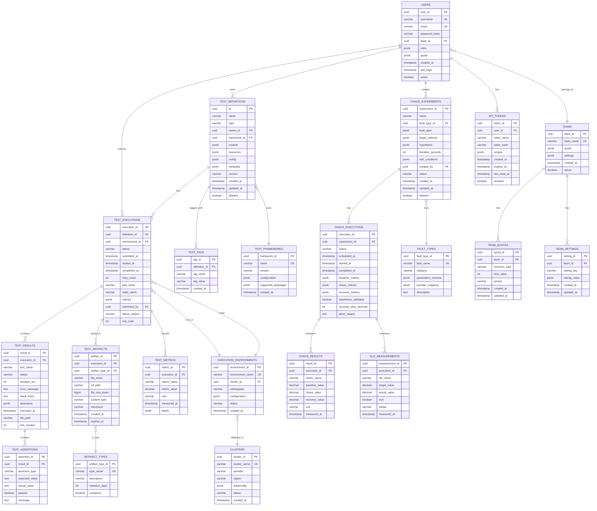
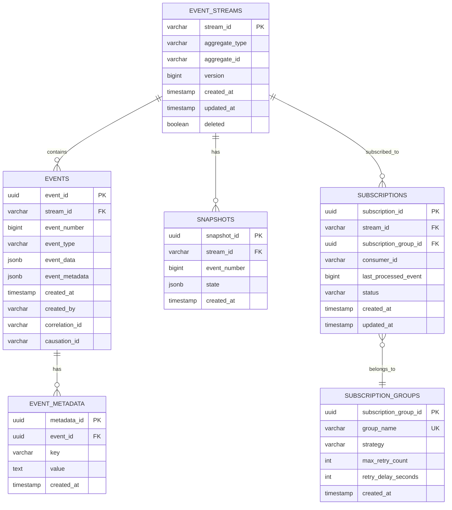
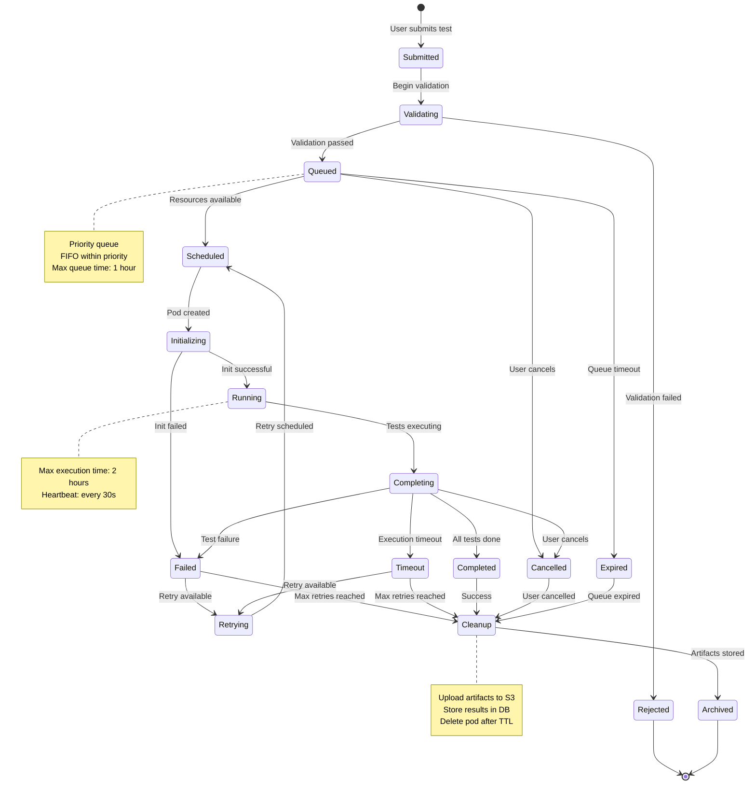
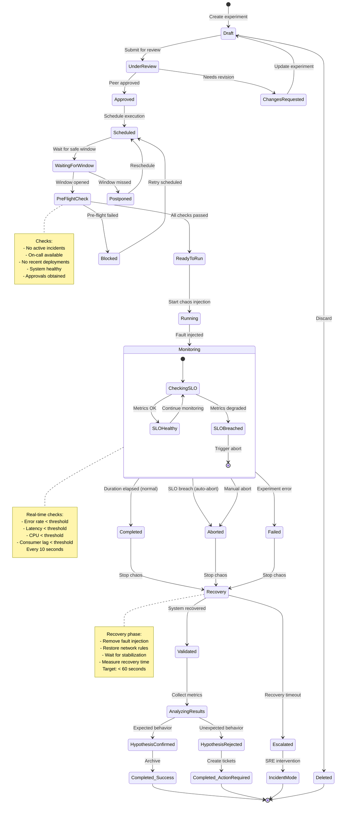
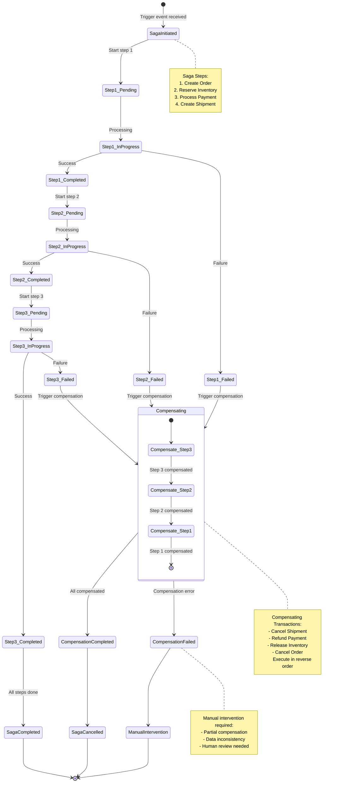

# Detailed Sequence & ER Diagrams
## Test Automation Architecture - Interaction Flows & Data Models

---

## Table of Contents
1. [Detailed Sequence Diagrams](#sequence-diagrams)
2. [Entity-Relationship Diagrams](#er-diagrams)
3. [State Transition Diagrams](#state-diagrams)

---

## 1. Detailed Sequence Diagrams {#sequence-diagrams}

### 1.1 Complete Test Execution Flow (K8s-Native)

### 1.2 Parallel Test Execution with Autoscaling

### 1.3 Chaos Engineering - Complete Workflow

### 1.4 Event-Driven Test - Saga Pattern

### 1.5 CI/CD Pipeline Integration

---

## 2. Entity-Relationship Diagrams {#er-diagrams}

### 2.1 Complete Database Schema - ER Diagram

### 2.2 Event Store Schema - ER Diagram

---

## 3. State Transition Diagrams {#state-diagrams}

### 3.1 Test Execution State Machine

### 3.2 Chaos Experiment State Machine

### 3.3 Event-Driven Saga State Machine

---

## Summary

This document provides:
- ✅ **6 Detailed Sequence Diagrams** covering all major workflows
- ✅ **2 Comprehensive ER Diagrams** (main DB schema + event store)
- ✅ **3 State Transition Diagrams** (test execution, chaos experiments, saga pattern)
- ✅ Complete interaction flows with timing and error handling
- ✅ Database relationships with all foreign keys and constraints
- ✅ State machine definitions with all possible transitions

These diagrams complement the HLD and LLD documents and provide visual representation of:
- System interactions and communication patterns
- Data relationships and schema design
- State management and lifecycle transitions
- Error handling and recovery flows

**Total Diagrams Created**: 11 detailed diagrams covering all aspects of the system.
