# Test Automation Architecture Diagrams
## Visual Guide to Enterprise Testing Systems

---

## Table of Contents
1. [Kubernetes-Native Distributed Test Orchestration Diagrams](#k8s-native)
2. [Event-Driven + Chaos Engineering Diagrams](#event-driven-chaos)
3. [Hybrid Architecture Diagrams](#hybrid)

---

## Architecture #1: Kubernetes-Native Distributed Test Orchestration {#k8s-native}

### 1.1 Class Diagram - Test Orchestration Platform

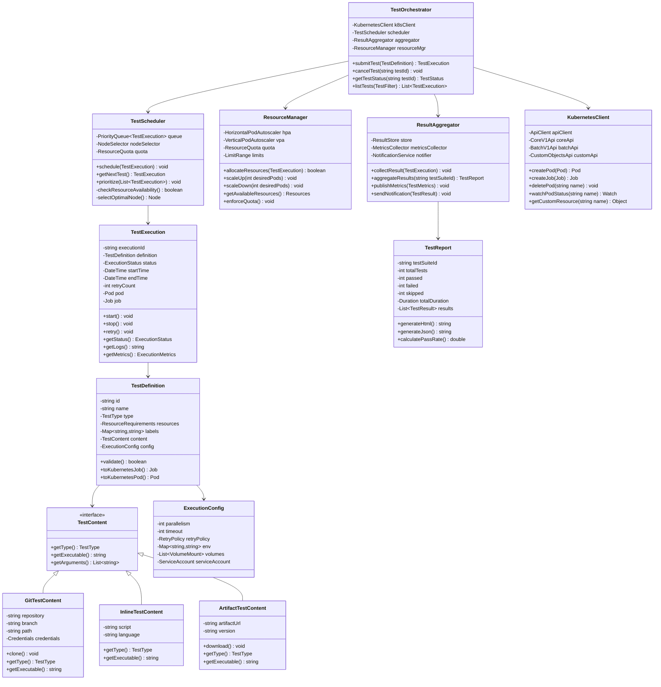

### 1.2 Data Flow Diagram - Test Execution Pipeline

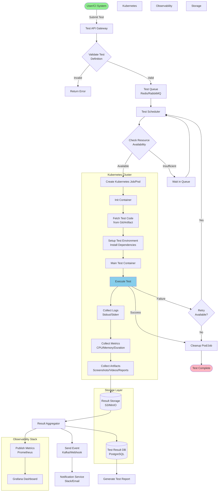

### 1.3 Sequence Diagram - Complete Test Execution Flow

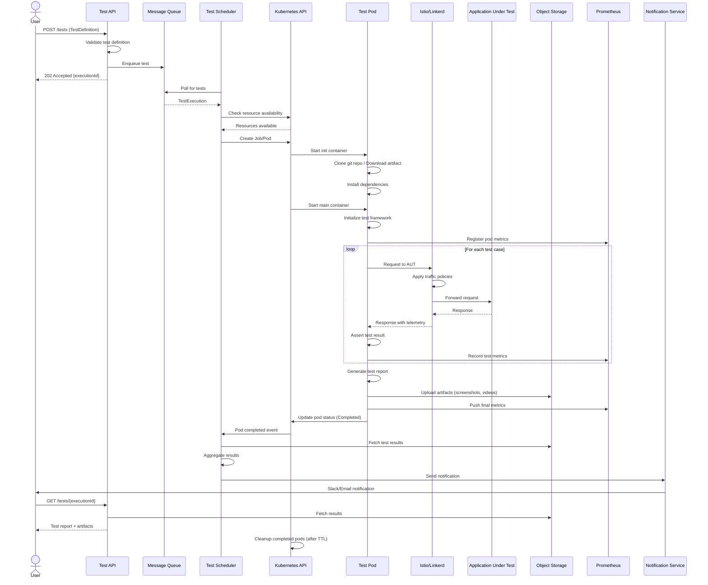

### 1.4 Component Diagram - Kubernetes Test Infrastructure

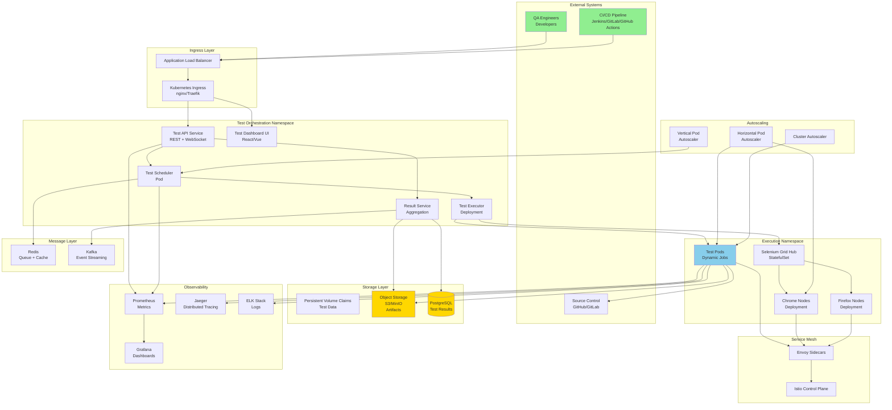

### 1.5 Deployment Diagram - Multi-Cluster Architecture

```mermaid
graph TB
    subgraph Region US-East
        subgraph EKS-Prod-Cluster
            ProdNS[Production Namespace<br/>Application Under Test]
            ProdTests[Production Test Namespace<br/>Smoke Tests Only]
            ProdMesh[Service Mesh<br/>mTLS Enabled]
        end

        subgraph EKS-Test-Cluster
            TestNS1[Test Namespace - Team A]
            TestNS2[Test Namespace - Team B]
            TestNS3[Test Namespace - Integration]
            SharedGrid[Shared Selenium Grid<br/>100 Chrome + 50 Firefox]
        end

        RDS1[(RDS PostgreSQL<br/>Test Results)]
        S3East[S3 Bucket<br/>Test Artifacts<br/>us-east-1]
    end

    subgraph Region US-West
        subgraph EKS-Perf-Cluster
            LoadGen[Load Generator<br/>k6/JMeter Pods]
            PerfMonitor[Performance Monitor<br/>Grafana/Prometheus]
        end

        S3West[S3 Bucket<br/>Performance Data<br/>us-west-2]
    end

    subgraph Region EU-Central
        subgraph EKS-EU-Cluster
            EUTests[EU Test Namespace<br/>GDPR Compliance Tests]
            EUGrid[EU Selenium Grid<br/>Data Residency]
        end

        RDS2[(RDS PostgreSQL<br/>EU Test Results)]
    end

    subgraph Global Services
        Route53[Route 53<br/>DNS Load Balancing]
        CloudFront[CloudFront CDN<br/>Dashboard Distribution]
        IAM[IAM Roles<br/>Cross-Cluster Auth]
        ECR[Elastic Container Registry<br/>Test Images]
    end

    subgraph Control Plane
        Argo[ArgoCD<br/>GitOps Deployment]
        Flux[Flux<br/>Config Sync]
        Rancher[Rancher<br/>Multi-Cluster Management]
    end

    Route53 --> ProdTests
    Route53 --> TestNS1
    Route53 --> EUTests

    Argo --> EKS-Prod-Cluster
    Argo --> EKS-Test-Cluster
    Argo --> EKS-EU-Cluster
    Flux --> EKS-Perf-Cluster

    Rancher --> EKS-Prod-Cluster
    Rancher --> EKS-Test-Cluster
    Rancher --> EKS-Perf-Cluster
    Rancher --> EKS-EU-Cluster

    TestNS1 --> RDS1
    TestNS2 --> RDS1
    TestNS3 --> RDS1
    ProdTests --> RDS1

    EUTests --> RDS2

    TestNS1 --> S3East
    SharedGrid --> S3East
    LoadGen --> S3West
    EUGrid --> S3East

    TestNS1 --> ECR
    SharedGrid --> ECR
    LoadGen --> ECR

    CloudFront --> Rancher

    style EKS-Prod-Cluster fill:#FFE4E1
    style EKS-Test-Cluster fill:#E0F7FA
    style EKS-Perf-Cluster fill:#FFF9C4
    style EKS-EU-Cluster fill:#E8F5E9
    style SharedGrid fill:#87CEEB
```

### 1.6 State Diagram - Test Execution Lifecycle

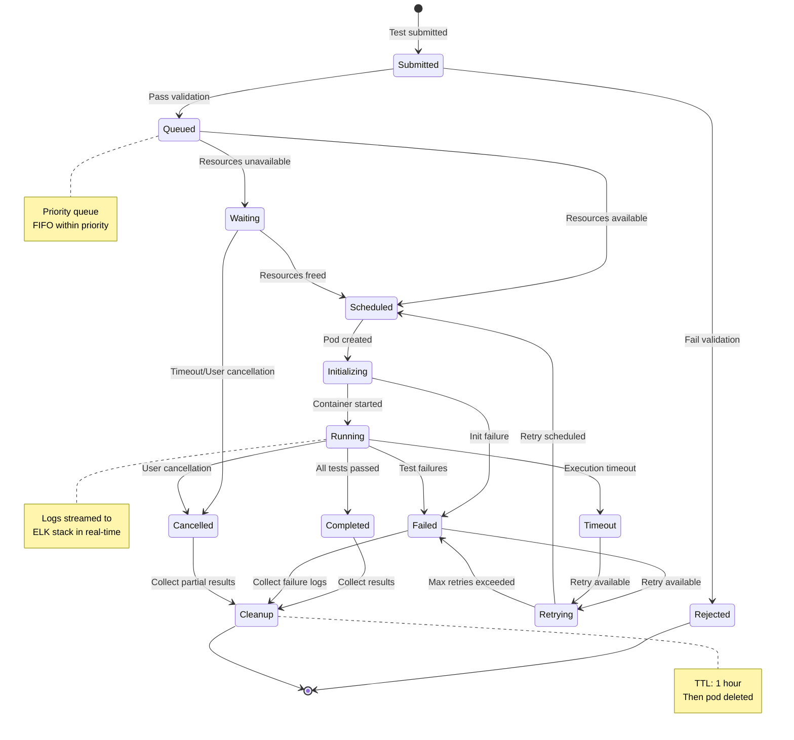

---

## Architecture #2: Event-Driven + Chaos Engineering {#event-driven-chaos}

### 2.1 Class Diagram - Event-Driven Test Framework

```mermaid
classDiagram
    class EventDrivenTestFramework {
        -EventBroker broker
        -ChaosEngine chaosEngine
        -EventStore eventStore
        -TestOrchestrator orchestrator
        +registerTest(EventTest) void
        +executeChaosExperiment(ChaosExperiment) ExperimentResult
        +replayEvents(string aggregateId) void
    }

    class EventTest {
        -string testId
        -string name
        -EventTrigger trigger
        -List~EventAssertion~ assertions
        -ChaosScenario chaosScenario
        -int timeout
        +execute() TestResult
        +validate() boolean
        +setupChaos() void
        +teardownChaos() void
    }

    class EventBroker {
        <<interface>>
        +subscribe(string topic, EventHandler) Subscription
        +publish(Event) void
        +createConsumerGroup(string groupId) ConsumerGroup
        +getConsumerLag() Map~string,long~
    }

    class KafkaBroker {
        -KafkaProducer producer
        -KafkaConsumer consumer
        -AdminClient adminClient
        +subscribe(string topic, EventHandler) Subscription
        +publish(Event) void
        +seekToBeginning() void
        +seekToTimestamp(long timestamp) void
    }

    class RabbitMQBroker {
        -Connection connection
        -Channel channel
        -Exchange exchange
        +subscribe(string topic, EventHandler) Subscription
        +publish(Event) void
        +declareQueue(QueueConfig) Queue
        +bindQueue(string queue, string routingKey) void
    }

    class NATSBroker {
        -Connection nc
        -JetStream js
        +subscribe(string topic, EventHandler) Subscription
        +publish(Event) void
        +createStream(StreamConfig) Stream
        +getStreamInfo() StreamInfo
    }

    class Event {
        -string eventId
        -string eventType
        -string aggregateId
        -long timestamp
        -Map~string,Object~ payload
        -Map~string,string~ metadata
        +validate() boolean
        +serialize() byte[]
        +deserialize(byte[]) Event
    }

    class EventAssertion {
        -string eventType
        -Predicate~Event~ condition
        -int timeoutMs
        +evaluate(Event) AssertionResult
        +waitForEvent() Event
    }

    class EventHandler {
        <<interface>>
        +handle(Event) void
        +onError(Exception) void
    }

    class TestEventHandler {
        -List~Event~ receivedEvents
        -CountDownLatch latch
        -EventMatcher matcher
        +handle(Event) void
        +waitForEvents(int count, int timeout) List~Event~
        +getReceivedEvents() List~Event~
    }

    class ChaosEngine {
        -List~ChaosProvider~ providers
        -ExperimentScheduler scheduler
        -SteadyStateValidator validator
        -RollbackManager rollbackMgr
        +executeExperiment(ChaosExperiment) ExperimentResult
        +scheduleExperiment(ChaosExperiment, Schedule) void
        +abortExperiment(string experimentId) void
        +getExperimentStatus(string experimentId) ExperimentStatus
    }

    class ChaosExperiment {
        -string experimentId
        -string name
        -TargetSelector targetSelector
        -FaultInjection fault
        -SteadyStateHypothesis hypothesis
        -int duration
        -BlastRadiusLimit blastRadius
        +validate() boolean
        +toKubernetesCRD() CustomResource
        +execute() ExperimentResult
    }

    class ChaosProvider {
        <<interface>>
        +getName() string
        +getSupportedFaults() List~FaultType~
        +injectFault(FaultInjection, TargetSelector) void
        +removeFault(string faultId) void
    }

    class LitmusChaosProvider {
        -KubernetesClient k8sClient
        +injectFault(FaultInjection, TargetSelector) void
        +createChaosEngine(ChaosExperiment) ChaosEngine
        +monitorExperiment(string engineId) ExperimentStatus
    }

    class GremlinChaosProvider {
        -GremlinApiClient apiClient
        -ApiKey apiKey
        +injectFault(FaultInjection, TargetSelector) void
        +createAttack(AttackConfig) Attack
        +haltAttack(string attackId) void
    }

    class AWSFaultInjectionProvider {
        -FisClient fisClient
        -IamRole role
        +injectFault(FaultInjection, TargetSelector) void
        +startExperiment(ExperimentTemplate) Experiment
        +stopExperiment(string experimentId) void
    }

    class FaultInjection {
        -FaultType type
        -Map~string,Object~ parameters
        -TargetSelector target
        +getPodDeleteConfig() PodDeleteConfig
        +getNetworkLatencyConfig() NetworkLatencyConfig
        +getResourceStressConfig() ResourceStressConfig
    }

    class SteadyStateHypothesis {
        -List~HealthCheck~ healthChecks
        -SLODefinition slo
        -int toleranceThreshold
        +validate() boolean
        +check() SteadyStateResult
    }

    class AIChaosSuggestionEngine {
        -DependencyGraphAnalyzer graphAnalyzer
        -TrafficPatternAnalyzer trafficAnalyzer
        -HistoricalFailureDB failureDB
        -MLModel predictionModel
        +analyzeArchitecture() ArchitectureInsights
        +suggestChaosTargets() List~ChaosTarget~
        +predictImpact(ChaosExperiment) ImpactPrediction
        +learnFromExperiment(ExperimentResult) void
    }

    class EventStore {
        -Database database
        -EventSerializer serializer
        +append(Event) void
        +readStream(string aggregateId) List~Event~
        +readFromPosition(long position) List~Event~
        +subscribeToAll(EventHandler) Subscription
    }

    class SagaCoordinator {
        -Map~string,SagaInstance~ activeSagas
        -EventBroker broker
        +startSaga(SagaDefinition, Event) SagaInstance
        +compensate(string sagaId) void
        +getSagaStatus(string sagaId) SagaStatus
    }

    EventDrivenTestFramework --> EventBroker
    EventDrivenTestFramework --> ChaosEngine
    EventDrivenTestFramework --> EventStore
    EventDrivenTestFramework --> EventTest

    EventBroker <|-- KafkaBroker
    EventBroker <|-- RabbitMQBroker
    EventBroker <|-- NATSBroker

    EventTest --> EventAssertion
    EventTest --> ChaosExperiment
    EventAssertion --> Event

    EventHandler <|-- TestEventHandler
    TestEventHandler --> Event

    ChaosEngine --> ChaosProvider
    ChaosEngine --> ChaosExperiment
    ChaosEngine --> SteadyStateHypothesis
    ChaosEngine --> AIChaosSuggestionEngine

    ChaosProvider <|-- LitmusChaosProvider
    ChaosProvider <|-- GremlinChaosProvider
    ChaosProvider <|-- AWSFaultInjectionProvider

    ChaosExperiment --> FaultInjection
    ChaosExperiment --> SteadyStateHypothesis

    EventStore --> Event
```

### 2.2 Data Flow Diagram - Event-Driven Test with Chaos Injection

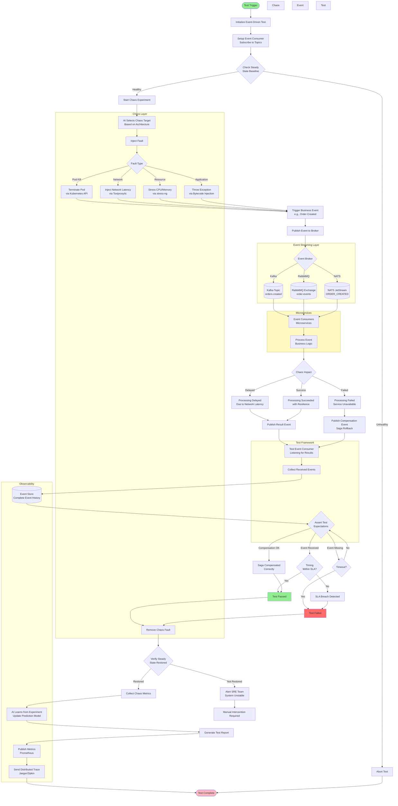

### 2.3 Sequence Diagram - Event-Driven Saga Test with Chaos

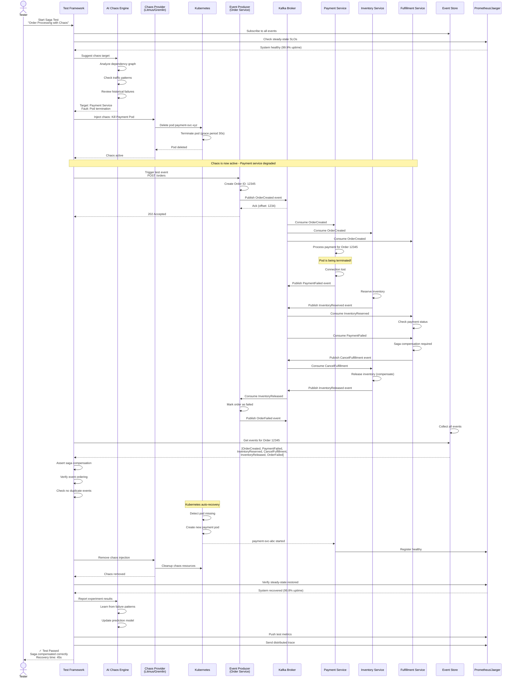

### 2.4 Activity Diagram - Chaos Engineering Workflow

```mermaid
flowchart TD
    Start([Start Chaos Program]) --> DefineHyp[Define Steady-State Hypothesis<br/>e.g., 99.9% availability, p99 < 200ms]

    DefineHyp --> IdentifyWeaknesses[Identify Potential Weaknesses]
    IdentifyWeaknesses --> ManualId[Manual: Architecture Review]
    IdentifyWeaknesses --> AIId[AI: Dependency Graph Analysis]

    ManualId --> CreateExp[Create Chaos Experiment]
    AIId --> CreateExp

    CreateExp --> DefineScope{Define Blast Radius}
    DefineScope -->|Dev| DevScope[Scope: Dev Namespace<br/>Impact: Low]
    DefineScope -->|Staging| StagingScope[Scope: Staging Cluster<br/>Impact: Medium]
    DefineScope -->|Prod| ProdScope[Scope: Canary Pods Only<br/>Impact: Controlled]

    DevScope --> DefineFault
    StagingScope --> DefineFault
    ProdScope --> DefineFault

    DefineFault[Define Fault Injection] --> InfraFault{Fault Category}

    InfraFault -->|Infrastructure| InfraTypes[Pod Kill / Network / DNS]
    InfraFault -->|Application| AppTypes[Exception / Latency / Error Response]
    InfraFault -->|Data| DataTypes[Event Duplication / Out-of-Order]
    InfraFault -->|Resource| ResourceTypes[CPU/Memory Stress]

    InfraTypes --> SetHalt
    AppTypes --> SetHalt
    DataTypes --> SetHalt
    ResourceTypes --> SetHalt

    SetHalt[Set Halt Conditions<br/>Auto-abort on SLO breach] --> SetDuration[Set Experiment Duration<br/>5-60 minutes]

    SetDuration --> PeerReview{Peer Review}
    PeerReview -->|Changes Requested| CreateExp
    PeerReview -->|Approved| ScheduleExp

    ScheduleExp[Schedule Experiment] --> GameDay{Type}
    GameDay -->|Automated| CICDGate[Run in CI/CD Pipeline]
    GameDay -->|Scheduled| CronJob[Cron: Every 4 hours]
    GameDay -->|Game Day| LiveEvent[Live Team Exercise]

    CICDGate --> PreCheck
    CronJob --> PreCheck
    LiveEvent --> PreCheck

    PreCheck[Pre-Experiment Checks] --> CheckOncall{On-Call<br/>Available?}
    CheckOncall -->|No| Postpone[Postpone Experiment]
    CheckOncall -->|Yes| CheckIncidents{Active<br/>Incidents?}
    CheckIncidents -->|Yes| Postpone
    CheckIncidents -->|No| CheckDeployments{Recent<br/>Deployments?}
    CheckDeployments -->|Yes < 2h| Postpone
    CheckDeployments -->|No| MeasureBaseline

    MeasureBaseline[Measure Baseline Metrics<br/>5 minute window] --> RunExperiment[Execute Chaos Experiment]

    RunExperiment --> MonitorReal[Real-time Monitoring]
    MonitorReal --> CheckMetrics{Metrics Status}

    CheckMetrics -->|SLO OK| ContinueChaos[Continue Experiment]
    CheckMetrics -->|SLO Breach| AutoAbort[Auto-Abort Experiment]
    CheckMetrics -->|Critical Alert| AutoAbort

    ContinueChaos --> TimeCheck{Duration<br/>Complete?}
    TimeCheck -->|No| MonitorReal
    TimeCheck -->|Yes| StopChaos[Stop Chaos Injection]

    AutoAbort --> StopChaos

    StopChaos --> ObserveRecovery[Observe System Recovery]
    ObserveRecovery --> RecoveryCheck{System<br/>Recovered?}

    RecoveryCheck -->|Yes| MeasureImpact[Measure Impact Metrics]
    RecoveryCheck -->|No, Wait| ObserveRecovery
    RecoveryCheck -->|No, Timeout| Escalate[Escalate to SRE]

    MeasureImpact --> CalculateBlastRadius[Calculate Actual Blast Radius<br/>Affected users, services, requests]
    CalculateBlastRadius --> CompareHypothesis{Hypothesis<br/>Validated?}

    CompareHypothesis -->|Yes| SuccessReport[Success: System Resilient]
    CompareHypothesis -->|No| FailureReport[Failure: Weakness Found]

    SuccessReport --> DocumentLearning
    FailureReport --> CreateJira[Create Jira Ticket<br/>Assign to Team]

    CreateJira --> DocumentLearning[Document Learning]
    DocumentLearning --> UpdateRunbook[Update Incident Runbook]
    UpdateRunbook --> ShareResults[Share Results<br/>Slack/Email/Wiki]

    ShareResults --> UpdateAI[Update AI Model<br/>with Experiment Data]
    UpdateAI --> NextExp{More<br/>Experiments?}

    NextExp -->|Yes| CreateExp
    NextExp -->|No| End([End])

    Postpone --> ScheduleRetry[Schedule Retry<br/>Next Available Slot]
    ScheduleRetry --> End

    Escalate --> PostMortem[Conduct Post-Mortem]
    PostMortem --> End

    style Start fill:#90EE90
    style End fill:#FFB6C1
    style AutoAbort fill:#FF6B6B
    style SuccessReport fill:#90EE90
    style FailureReport fill:#FFD700
    style Escalate fill:#FF6B6B
```

### 2.5 Component Diagram - Event-Driven + Chaos Architecture

```mermaid
graph TB
    subgraph Test Orchestration Layer
        TestDSL[Test DSL Engine<br/>Define event-driven tests]
        TestRunner[Test Runner<br/>Execute async tests]
        AssertionEngine[Assertion Engine<br/>Event matching & timing]
    end

    subgraph Chaos Control Plane
        ChaosAPI[Chaos API<br/>REST + gRPC]
        ChaosScheduler[Chaos Scheduler<br/>Cron + Event-triggered]
        AIEngine[AI Chaos Engine<br/>Target Selection]
        ExperimentDB[(Experiment Database<br/>History + Results)]
    end

    subgraph Chaos Providers
        Litmus[LitmusChaos<br/>K8s-native]
        Gremlin[Gremlin<br/>Enterprise SaaS]
        AWSFIS[AWS FIS<br/>Cloud-native]
        Toxiproxy[Toxiproxy<br/>Network proxy]
    end

    subgraph Event Streaming Platform
        KafkaCluster[Kafka Cluster<br/>3 Brokers]
        SchemaRegistry[Schema Registry<br/>Avro/Protobuf]
        KafkaConnect[Kafka Connect<br/>CDC Pipelines]
        KSQL[ksqlDB<br/>Stream Processing]
    end

    subgraph Microservices Under Test
        OrderSvc[Order Service<br/>Event Producer]
        PaymentSvc[Payment Service<br/>Event Consumer]
        InventorySvc[Inventory Service<br/>Event Consumer]
        FulfillmentSvc[Fulfillment Service<br/>Saga Coordinator]
    end

    subgraph Service Mesh
        IstioCP[Istio Control Plane<br/>Pilot + Citadel]
        EnvoyProxies[Envoy Sidecars<br/>Traffic Management]
        FaultInjection[Istio Fault Injection<br/>Delay/Abort Rules]
    end

    subgraph Event Store & Replay
        EventStoreDB[(EventStoreDB<br/>Append-only Log)]
        Projections[Event Projections<br/>Read Models]
        ReplayEngine[Replay Engine<br/>Time Travel Queries]
    end

    subgraph Observability Platform
        PrometheusTS[(Prometheus<br/>Time-Series DB)]
        JaegerTracing[Jaeger<br/>Distributed Tracing]
        GrafanaDash[Grafana<br/>Dashboards]
        AlertManager[Alert Manager<br/>PagerDuty Integration]
    end

    subgraph Test Data Management
        TestDataGen[Test Data Generator<br/>Faker + Templates]
        DataSeeder[Data Seeder<br/>Database Init]
        Idempotency[Idempotency Checker<br/>Duplicate Detection]
    end

    TestDSL --> TestRunner
    TestRunner --> AssertionEngine
    TestRunner --> ChaosAPI

    ChaosAPI --> ChaosScheduler
    ChaosAPI --> AIEngine
    ChaosScheduler --> ExperimentDB
    AIEngine --> ExperimentDB

    ChaosAPI --> Litmus
    ChaosAPI --> Gremlin
    ChaosAPI --> AWSFIS
    ChaosAPI --> Toxiproxy

    Litmus --> OrderSvc
    Litmus --> PaymentSvc
    Gremlin --> InventorySvc
    Toxiproxy --> KafkaCluster

    TestRunner --> TestDataGen
    TestDataGen --> DataSeeder
    DataSeeder --> OrderSvc

    OrderSvc --> EnvoyProxies
    PaymentSvc --> EnvoyProxies
    InventorySvc --> EnvoyProxies
    FulfillmentSvc --> EnvoyProxies

    EnvoyProxies --> IstioCP
    IstioCP --> FaultInjection

    OrderSvc --> KafkaCluster
    PaymentSvc --> KafkaCluster
    InventorySvc --> KafkaCluster
    FulfillmentSvc --> KafkaCluster

    KafkaCluster --> SchemaRegistry
    KafkaCluster --> KSQL
    KafkaConnect --> KafkaCluster

    TestRunner --> KafkaCluster
    AssertionEngine --> KafkaCluster

    KafkaCluster --> EventStoreDB
    EventStoreDB --> Projections
    EventStoreDB --> ReplayEngine
    TestRunner --> ReplayEngine

    OrderSvc --> PrometheusTS
    PaymentSvc --> PrometheusTS
    Litmus --> PrometheusTS
    Gremlin --> PrometheusTS

    OrderSvc --> JaegerTracing
    PaymentSvc --> JaegerTracing
    EnvoyProxies --> JaegerTracing

    PrometheusTS --> GrafanaDash
    PrometheusTS --> AlertManager
    JaegerTracing --> GrafanaDash

    AssertionEngine --> Idempotency

    style TestRunner fill:#87CEEB
    style ChaosAPI fill:#FFB6C1
    style AIEngine fill:#DDA0DD
    style KafkaCluster fill:#FFD700
    style EventStoreDB fill:#90EE90
```

### 2.6 State Diagram - Chaos Experiment Lifecycle

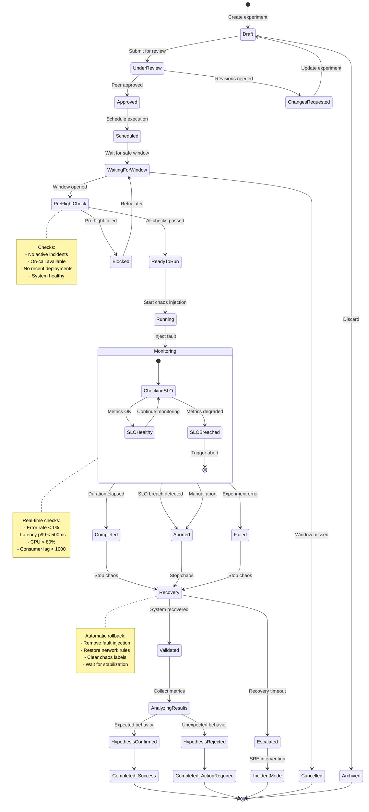

---

## Hybrid Architecture: Combining Both Approaches {#hybrid}

### 3.1 Unified Architecture Diagram

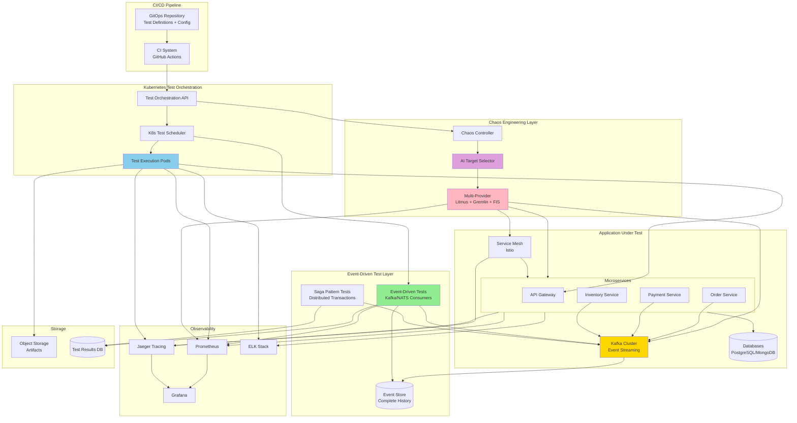

### 3.2 Complete Test Execution Sequence (Hybrid)

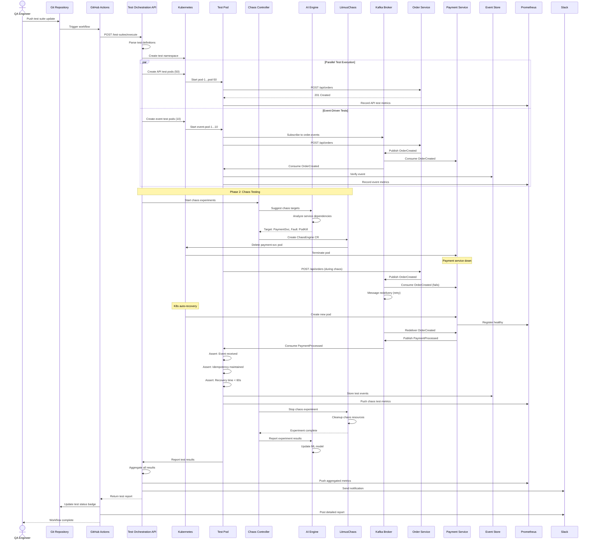

### 3.3 Integration Points Matrix

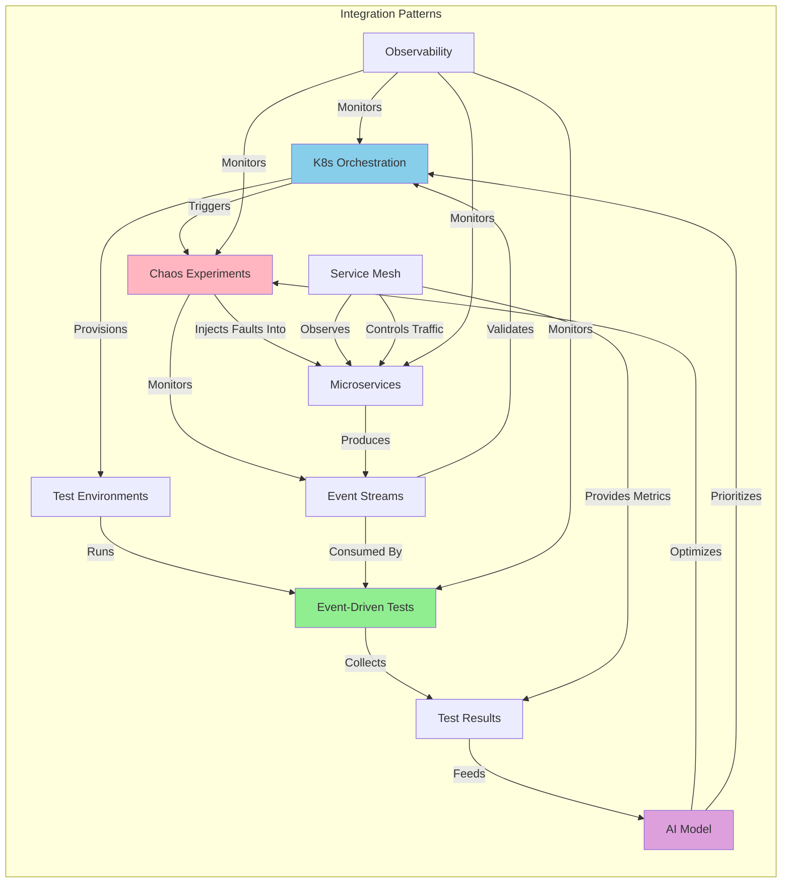

---

## Summary

This document provides comprehensive visual representations of both advanced test automation architectures:

### Kubernetes-Native Orchestration Diagrams
1. **Class Diagram**: Complete OOP design of test orchestration platform
2. **Data Flow Diagram**: End-to-end test execution pipeline
3. **Sequence Diagram**: Detailed interaction flow with timing
4. **Component Diagram**: Infrastructure layout with all components
5. **Deployment Diagram**: Multi-cluster, multi-region architecture
6. **State Diagram**: Test execution lifecycle states

### Event-Driven + Chaos Engineering Diagrams
1. **Class Diagram**: Event-driven test framework and chaos engine design
2. **Data Flow Diagram**: Event flows with chaos injection points
3. **Sequence Diagram**: Saga pattern test with chaos and recovery
4. **Activity Diagram**: Complete chaos engineering workflow
5. **Component Diagram**: Event streaming and chaos infrastructure
6. **State Diagram**: Chaos experiment lifecycle management

### Hybrid Architecture
1. **Unified Architecture**: Combined system showing all components
2. **Complete Sequence**: End-to-end test execution with both approaches
3. **Integration Matrix**: How components interact across architectures

These diagrams are rendered using Mermaid and can be viewed in any Markdown viewer that supports Mermaid syntax (GitHub, GitLab, VS Code with plugins, etc.).
